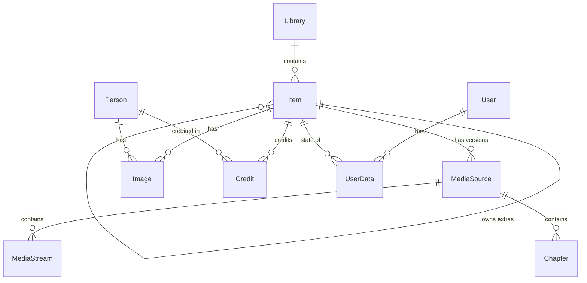

# Mavio Domain Model

> English | [简体中文](domain.zh-CN.md)

> Related: [Architecture](architecture.md) · [Development](development.md) · [Testing](testing.md) · [Roadmap](roadmap.md)

The domain model is defined in `libs/core` (Go package `core`). It depends only on the standard library; storage, the media pipeline, the scanner and the API all work in terms of these types and the repository ports in §9.

---

## 1. Overview

| Entity | Meaning |
| :--- | :--- |
| `Library` | A named set of root folders scanned as one collection |
| `Item` | A node in a library: a playable item, a container (series, album, …) or a curated collection/playlist |
| `MediaSource` | One playable version of an item: a file with its container facts, streams and chapters |
| `MediaStream` | One elementary stream (video, audio, subtitle, …) or a sidecar subtitle file |
| `Image` | An artwork file of an item or person |
| `Person` / `Credit` | Someone credited on items, and the link with role and billing order |
| `User` / `UserPolicy` / `UserPreferences` | An account, what it may access, and its playback defaults |
| `UserData` | One user's state for one item: played, resume position, favorite, … |
| `Job` | A durable unit of background work |

---

## 2. Identifiers

* Every entity is identified by `core.ID`, a **UUIDv7** (RFC 9562). IDs sort by creation time, which keeps database indexes append-friendly; IDs created by one process are strictly increasing, even within a millisecond.
* The text form is the canonical `xxxxxxxx-xxxx-7xxx-xxxx-xxxxxxxxxxxx`; `ID` implements `encoding.TextMarshaler`, so it appears as a string in JSON.
* The zero value `NilID` means "none" (e.g. a top-level item's `ParentID`).

---

## 3. Enumerations

All enumerations are string types with stable lowercase values, used unchanged in the database and in JSON. Each has a list of all values and a `Valid()` method.

| Type | Values |
| :--- | :--- |
| `LibraryKind` | `movies`, `shows`, `music`, `music_videos`, `home_videos`, `books`, `photos`, `mixed` |
| `ItemKind` | `movie`, `series`, `season`, `episode`, `video`, `music_artist`, `music_album`, `track`, `music_video`, `audiobook`, `book`, `photo_album`, `photo`, `folder`, `collection`, `playlist` |
| `ExtraKind` | `trailer`, `clip`, `behind_the_scenes`, `deleted_scene`, `interview`, `scene`, `sample`, `featurette`, `short`, `theme_song`, `theme_video`, `other` |
| `StreamKind` | `video`, `audio`, `subtitle`, `attachment`, `image`, `data` |
| `VideoRange` | `sdr`, `hdr10`, `hdr10plus`, `hlg`, `dolby_vision` |
| `ImageKind` | `primary`, `backdrop`, `logo`, `thumb`, `banner`, `art`, `disc`, `screenshot` |
| `CreditKind` | `actor`, `guest_star`, `director`, `writer`, `producer`, `creator`, `composer`, `conductor`, `lyricist`, `artist`, `author`, `narrator`, `other` |
| `SeriesStatus` | `continuing`, `ended`, `unreleased` |
| `SubtitleMode` | `""` (follow stream flags), `always`, `foreign`, `forced`, `none`, `smart` |
| `SortField` | `name`, `date_added`, `premiere_date`, `production_year`, `community_rating`, `runtime`, `index`, `random`, `last_played`, `play_count` |
| `JobState` | `pending`, `running`, `succeeded`, `failed` |
| `Provider` | `tmdb`, `imdb`, `tvdb`, `musicbrainz` (well-known; plugins may add others) |

---

## 4. Libraries and Items

### 4.1 Library
* `Kind` decides how the scanner interprets the folders; `Paths` are absolute root folders, and a path belongs to at most one library: a library's paths may not equal, contain or lie inside another library's paths (`ErrConflict`).
* `ScanInterval` is the period of scheduled reconciliation scans (zero disables them); `PreferredLanguage` (ISO 639-1) and `MetadataCountry` (ISO 3166-1 alpha-2) steer metadata providers.

### 4.2 Item
There is a single `Item` type for every kind; `Kind` selects which fields are meaningful. This maps directly onto one items table and avoids a type hierarchy.

| Field group | Fields |
| :--- | :--- |
| Identity and hierarchy | `ID`, `LibraryID`, `ParentID`, `Kind`, `Path` |
| Titles and text | `Name`, `SortName`, `OriginalTitle`, `Overview`, `Tagline` |
| Numbering | `IndexNumber`, `ParentIndexNumber`, `IndexNumberEnd` |
| Dates and ratings | `ProductionYear`, `PremiereDate`, `EndDate`, `Runtime`, `OfficialRating`, `ParentalRating`, `CommunityRating` (0–10), `CriticRating` (0–100) |
| Classification | `Genres`, `Tags`, `Studios`, `ExternalIDs` (by `Provider`) |
| Music | `Artists`, `AlbumArtists` |
| Series | `SeriesStatus` |
| Extras | `Extra` (`ExtraKind`), `OwnerID` |
| Bookkeeping | `DateAdded`, `FileModified`, `MetadataRefreshedAt` |

### 4.3 Hierarchies
Hierarchies use `ParentID`; numbering uses `IndexNumber` / `ParentIndexNumber`:

| Library kind | Hierarchy | Numbering |
| :--- | :--- | :--- |
| `shows` | `series` → `season` → `episode` | season: `IndexNumber` = season number; episode: `ParentIndexNumber` = season, `IndexNumber` = episode, `IndexNumberEnd` = last episode of a multi-episode file |
| `music` | `music_artist` → `music_album` → `track` | track: `ParentIndexNumber` = disc, `IndexNumber` = track |
| `movies`, `music_videos`, `home_videos`, `books` | top-level items, optionally inside `folder` items | — |
| `photos` | `photo_album` → `photo` | — |

`collection` and `playlist` items are user-curated containers without a `Path`.

* `ItemKind.IsContainer()` is true for kinds that group other items (series, season, artist, album, photo album, folder, collection, playlist).
* `ItemKind.HasMedia()` is true for kinds backed by a playable file (movie, episode, video, track, music video, audiobook); these have media sources.

### 4.4 Extras
Trailers, featurettes, theme songs and other extras are ordinary items with `Extra` set and `OwnerID` pointing to the item they belong to. Queries exclude extras unless `ItemQuery.IncludeExtras` is set.

### 4.5 Rules (`Item.Validate`)
* `ID`, `LibraryID`, a valid `Kind` and a non-empty `Name` are required; an item cannot be its own parent.
* An item with `Extra` set must use a valid `ExtraKind` and have an `OwnerID`.
* `CommunityRating` is within 0–10, `CriticRating` within 0–100, and `ParentalRating` is not negative.

### 4.6 Ratings
`OfficialRating` is the content rating as published (e.g. "PG-13"); `ParentalRating` is its score in the country's rating system, set by metadata providers, with zero meaning unrated. Rating filters (`ItemQuery.MaxRating`, `UserPolicy.MaxParentalRating`) compare scores.

---

## 5. Media Sources, Streams and Chapters

* A `MediaSource` is one playable version of an item; an item can have several (e.g. 4K and 1080p versions), distinguished by `Name`. It records `Path`, `Container` (ffprobe format name), `Size`, `Duration`, `Bitrate`, its `Streams` and `Chapters`, the video `Keyframes` used to cut HLS segments (nil until extracted) and `ProbedAt`.
* A `MediaStream` is one elementary stream, or a sidecar subtitle file with `ExternalPath` set and a synthetic `Index` after the embedded streams. Codec names follow ffprobe (`hevc`, `eac3`, `subrip`, …); `CodecTag` keeps the container tag (`hvc1` vs `hev1`), which matters for direct-play decisions; `Language` is ISO 639-2/B.
* Video streams carry dimensions, `FrameRate` (`Rational`, e.g. 24000/1001), pixel format and bit depth, color description (range, primaries, transfer, space), `Range` (`VideoRange`), the Dolby Vision configuration record (`DolbyVision`: profile, level, base-layer compatibility ID, RPU / EL / BL presence), interlacing, rotation and sample aspect ratio.
* Audio streams carry channels, channel layout and sample rate; subtitle streams carry `TextBased` (false for bitmap formats such as PGS and VobSub, which can only be burned in).
* A `Chapter` is a named start position with an optional extracted thumbnail.
* Rules: a source needs `ID`, `ItemID` and `Path`, and non-negative size, duration and bitrate; every stream needs a valid `Kind`, a non-negative index, non-negative dimensions and channel count.

---

## 6. Images, People and Credits

* An `Image` belongs to an item or a person (`OwnerID`) and has a `Kind`; several images of one kind are ordered by `Index` (e.g. multiple backdrops). It records the local `Path` and/or the `RemoteURL` it came from, its dimensions, and `Blurhash` / `Thumbhash` placeholders. An image needs at least a path or a remote URL.
* A `Person` has a name, biography, birth/death data and `ExternalIDs`.
* A `Credit` links a person to an item with a `CreditKind`, an optional `Role` (the character played or a more specific job) and a billing `Order`.

---

## 7. Users

* A `User` has a unique, case-insensitive `Name`. It authenticates either with `PasswordHash` (a PHC-format string such as `$argon2id$…`) or through a plugin named by `AuthProvider`; one of the two is required. `Admin` and `Disabled` control the account.
* `UserPolicy`:
  * `Libraries` limits access to listed libraries (nil means all); `CanAccessLibrary` applies it.
  * `MaxParentalRating` is the highest allowed rating score (content ratings such as "PG-13" map to scores per country rating system; zero means unrestricted); `BlockUnrated` hides unrated items when a maximum is set.
  * `AllowTranscoding`, `AllowDownload`, `MaxStreamingBitrate` (bits per second, zero means unlimited) and `MaxSessions` (zero means unlimited).
* `UserPreferences`: preferred audio and subtitle languages (ISO 639-2/B, in order), `SubtitleMode`, and whether to prefer the default audio track over the preferred language.
* `UserData` is one user's state for one item: `Played`, `PlayCount`, resume `Position`, the last selected audio/subtitle streams (subtitle `-1` means off), `Favorite`, an optional 0–10 `Rating`, and timestamps. Missing state means "never interacted".

---

## 8. Background Jobs

A `Job` is durable background work stored in the database (scans, metadata refreshes, image extraction, …).

* `Kind` names the work (e.g. `library.scan`); `Payload` is its kind-specific argument, typically JSON.
* `UniqueKey` deduplicates: enqueueing while a pending or running job has the same key does nothing (e.g. `library.scan:<library id>`).
* Workers **lease** due jobs by priority (then by `RunAt`); a lease expires at `LeaseExpiresAt` unless extended, after which the job becomes available again, so a crashed worker never loses work. `Attempts` counts leases, so an attempt cut short by a crash counts too.
* `Extend`, `Complete` and `Fail` require the lease owner; a worker whose lease has expired and been taken over gets `ErrConflict`.
* A failed attempt is retried after `RetryDelay(attempts)` — 30 s, then doubling (1 min, 2 min, …) up to one hour — until `MaxAttempts` is reached; then the job is `failed`.
* States: `pending` → `running` → `succeeded` / back to `pending` for a retry / `failed`.

---

## 9. Repository Ports

`core.Store` is the single entry point to storage; `libs/store` implements it for SQLite and PostgreSQL. Everything else depends only on these interfaces.

| Port | Responsibilities |
| :--- | :--- |
| `LibraryRepository` | CRUD; deleting a library deletes all its items |
| `ItemRepository` | `Get`, `GetByPath`, `Query` (paged), `Walk` (streams all matches in ID order as `iter.Seq2`), batch `Upsert` by ID (a path is unique per library: `ErrConflict`), `Delete` (cascades to descendants, extras, media sources, images, credits and user data) |
| `MediaSourceRepository` | List and `Replace` an item's media sources |
| `ImageRepository` | List and `Replace` an owner's images |
| `PersonRepository` | `Get`, case-insensitive `FindByName`, batch `Upsert`, list and `Replace` an item's credits |
| `UserRepository` | CRUD and case-insensitive `GetByName` |
| `UserDataRepository` | `Get` (`ErrNotFound` when absent), `GetMany` for a list of items, `Put` |
| `JobQueue` | `Enqueue` (reports whether added), `Lease`, `Extend`, `Complete`, `Fail` |

* **Transactions**: `Store.InTx` runs a function with a `Store` bound to one transaction; returning an error rolls it back.
* **Replace semantics**: `Replace*` methods set the complete set for an owner, removing anything not in the new set — scans and metadata refreshes always write whole sets.
* **Errors**: implementations wrap `ErrNotFound`, `ErrConflict` (unique-key or state conflicts) and `ErrInvalid` (domain rule violations); callers test them with `errors.Is`.

### 9.1 Item Queries
`ItemQuery` filters with zero values meaning "no filter":

* Scope: `LibraryIDs` (callers apply the user's library policy here), `ParentID` with optional `Recursive` (all descendants), `Kinds`, `IncludeExtras`.
* Content: `Search` matches a substring of the name or original title, ignoring case, accents and full-/half-width differences (so CJK titles and short queries work); `Genres`, `Tags`, `Studios` (match any); `PersonID`; `YearFrom`–`YearTo`; `MaxRating` (items without a rating are included unless `SkipUnrated`).
* Names sort case- and accent-insensitively; undated items sort last by premiere date, and items never played sort last by last-played time.
* Per user (require `UserID`): `Played`, `Favorite`, `Resumable`, and the `last_played` / `play_count` sorts.
* Ordering: a list of `SortSpec`; results are always tie-broken by ID, so paging is stable.
* Paging: `Limit` (0 means the maximum, `MaxPageSize` = 1000) and `Offset`; `Page.Total` is the count across all pages.
* `Validate` rejects inconsistent queries: out-of-range limits, negative offsets, `Recursive` without a parent, an empty year range, unknown kinds or sort fields, and user filters or sorts without a user.
