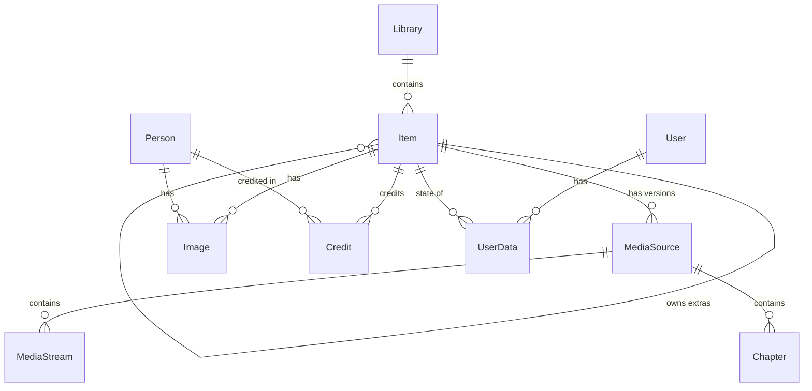

# Mavio Domain Model

> English | [简体中文](domain.zh-CN.md)

> Related: [Architecture](architecture.md) · [Development](development.md) · [Testing](testing.md) · [Roadmap](roadmap.md)

The domain model is defined in `libs/core` (Go package `core`). It depends only on the standard library; storage, the media pipeline, the scanner and the API all work in terms of these types and the repository ports in §9.

---

## 1. Overview

| Entity | Meaning |
| :--- | :--- |
| `Library` | A named set of root folders scanned as one collection |
| `Item` | A node in a library: a playable item, a container (series, album, …) or a curated collection/playlist |
| `MediaSource` | One playable version of an item: a file with its container facts, streams and chapters |
| `MediaStream` | One elementary stream (video, audio, subtitle, …) or a sidecar subtitle file |
| `Image` | An artwork file of an item or person |
| `Person` / `Credit` | Someone credited on items, and the link with role and billing order |
| `User` / `UserPolicy` / `UserPreferences` | An account, what it may access, and its playback defaults |
| `UserData` | One user's state for one item: played, resume position, favorite, … |
| `Job` | A durable unit of background work |
| `PluginConfig` | The configuration an administrator gave a plugin |
| `DisplayPreferences` | A user's settings for how one client shows one view |
| `ServerSettings` | What administrators change while the server runs: transcoding, network, plugin catalogs, the password reset plugin |
| `APIKey` | A token an integration calls the API with, as the administrator who created it |
| `Activity` | Something that happened on the server, kept in the activity log |

---

## 2. Identifiers

* Every entity is identified by `core.ID`, a **UUIDv7** (RFC 9562). IDs sort by creation time, which keeps database indexes append-friendly; IDs created by one process are strictly increasing, even within a millisecond.
* The text form is the canonical `xxxxxxxx-xxxx-7xxx-xxxx-xxxxxxxxxxxx`; `ID` implements `encoding.TextMarshaler`, so it appears as a string in JSON.
* The zero value `NilID` means "none" (e.g. a top-level item's `ParentID`).

---

## 3. Enumerations

All enumerations are string types with stable lowercase values, used unchanged in the database and in JSON. Each has a list of all values and a `Valid()` method.

| Type | Values |
| :--- | :--- |
| `LibraryKind` | `movies`, `shows`, `music`, `music_videos`, `home_videos`, `books`, `photos`, `mixed`, `collections`, `playlists` |
| `ItemKind` | `movie`, `series`, `season`, `episode`, `video`, `music_artist`, `music_album`, `track`, `music_video`, `audiobook`, `book`, `photo_album`, `photo`, `folder`, `collection`, `playlist` |
| `ExtraKind` | `trailer`, `clip`, `behind_the_scenes`, `deleted_scene`, `interview`, `scene`, `sample`, `featurette`, `short`, `theme_song`, `theme_video`, `other` |
| `StreamKind` | `video`, `audio`, `subtitle`, `attachment`, `image`, `data` |
| `VideoRange` | `sdr`, `hdr` |
| `VideoRangeType` | `sdr`, `hdr10`, `hdr10plus`, `hlg`, `dovi`, `dovi_hdr10`, `dovi_hlg`, `dovi_sdr`, `dovi_el`, `dovi_hdr10plus`, `dovi_el_hdr10plus`, `dovi_invalid` |
| `AudioSpatialFormat` | `""` (none), `dolby_atmos`, `dtsx` |
| `ImageKind` | `primary`, `backdrop`, `logo`, `thumb`, `banner`, `art`, `disc`, `screenshot` |
| `CreditKind` | `actor`, `guest_star`, `director`, `writer`, `producer`, `creator`, `composer`, `conductor`, `lyricist`, `artist`, `author`, `narrator`, `other` |
| `SeriesStatus` | `continuing`, `ended`, `unreleased` |
| `Video3DFormat` | `half_sbs`, `full_sbs`, `half_tab`, `full_tab`, `mvc` |
| `MetadataField` | `cast`, `genres`, `production_locations`, `studios`, `tags`, `name`, `overview`, `runtime`, `official_rating` |
| `SubtitleMode` | `""` (follow stream flags), `always`, `foreign`, `forced`, `none`, `smart` |
| `SortField` | `name`, `date_added`, `premiere_date`, `production_year`, `community_rating`, `runtime`, `index`, `random`, `last_played`, `play_count`, `list_order` |
| `JobState` | `pending`, `running`, `succeeded`, `failed` |
| `Provider` | `tmdb`, `tmdb_collection`, `imdb`, `tvdb`, `tvmaze`, `anidb`, `anilist`, `anisearch` (anime databases, one entry per season), `musicbrainz_artist`, `musicbrainz_album_artist`, `musicbrainz_album`, `musicbrainz_release_group`, `musicbrainz_track` (well-known; plugins may add others) |

---

## 4. Libraries and Items

### 4.1 Library
* `Kind` decides how the scanner interprets the folders; `Paths` are absolute root folders, and a path belongs to at most one library: a library's paths may not equal, contain or lie inside another library's paths (`ErrConflict`). The curated kinds (`LibraryKind.Curated`), `collections` and `playlists`, hold the collections and playlists users curate instead of scanned folders: they have no paths, are never scanned, and there is at most one library of each (`ErrConflict`), which the server creates when first needed.
* `ScanInterval` is the period of scheduled reconciliation scans (zero disables them); `PreferredLanguage` (ISO 639-1) and `MetadataCountry` (ISO 3166-1 alpha-2) steer metadata providers.
* `SaveLocalMetadata` writes each item's NFO file and the artwork chosen or downloaded for it next to its media, where scans read them back; `AutoCollections` puts movies into collections named after the providers' collections (movie sets), found by their `tmdb_collection` ID, else by name, and created when first needed.
* `ExtractTrickplay` and `ExtractChapterImages` make thumbnail sheets of videos and an image of each chapter; `AnalyzeLoudness` measures the loudness of tracks.
* `Providers` (`ProviderOrder`) names, per capability (metadata, images, subtitles, lyrics, segments), the providers the library uses by plugin ID, in order: a nil list uses every provider in its default order, an empty one none; a list naming a provider twice or an empty ID is `ErrInvalid`. `DownloadLyrics` has refreshes download lyrics for tracks without a lyric file from the library's lyrics providers.

### 4.2 Item
There is a single `Item` type for every kind; `Kind` selects which fields are meaningful. This maps directly onto one items table and avoids a type hierarchy.

| Field group | Fields |
| :--- | :--- |
| Identity and hierarchy | `ID`, `LibraryID`, `ParentID`, `Kind`, `Path`, `UserID` (the user a playlist belongs to) |
| Titles and text | `Name`, `SortName`, `OriginalTitle`, `Overview`, `Tagline` |
| Numbering | `IndexNumber`, `ParentIndexNumber`, `IndexNumberEnd` |
| Dates and ratings | `ProductionYear`, `PremiereDate`, `EndDate`, `Runtime`, `OfficialRating`, `CustomRating`, `ParentalRating`, `InheritedRating`, `CommunityRating` (0–10), `CriticRating` (0–100) |
| Classification | `Genres`, `Tags`, `Studios`, `ExternalIDs` (by `Provider`), `ProductionLocations` (countries), `RemoteTrailers` (URLs) |
| Movie and video | `CollectionName` (movie set), `AspectRatio`, `Video3DFormat` |
| Music | `Artists`, `AlbumArtists`, `Album` |
| Series | `SeriesStatus`, `AirDays`, `AirTime`, `DisplayOrder` |
| Episode | `AirsBeforeSeasonNumber`, `AirsAfterSeasonNumber`, `AirsBeforeEpisodeNumber` (where a special airs) |
| Extras | `Extra` (`ExtraKind`), `OwnerID` |
| Metadata control | `MetadataLanguage`, `MetadataCountry` (override the library's), `Locked`, `LockedFields` (`MetadataField`) |
| Audio | `Loudness`, the integrated loudness of a track, or of an album's tracks together weighted by duration, in LUFS (EBU R128); `NormalizationGain` is the gain to −18 LUFS |
| Bookkeeping | `DateAdded`, `FileModified`, `MetadataRefreshedAt`, `ScanGeneration` (the scan that last saw the item), `MissingSince` (see §4.7) |

The model follows Jellyfin's and grows with the roadmap: fields are added when a phase needs them. `SortName` is the user's sort name (Jellyfin's `ForcedSortName`); the computed sort form is a storage key. An episode's series and season are its ancestors, not copied names. A locked item, or a locked field group, is not changed by metadata providers; the item's own NFO file, which records the locks, still applies. Administrators' edits set fields directly, locked or not.

### 4.3 Hierarchies
Hierarchies use `ParentID`; numbering uses `IndexNumber` / `ParentIndexNumber`:

| Library kind | Hierarchy | Numbering |
| :--- | :--- | :--- |
| `shows` | `series` → `season` → `episode` | season: `IndexNumber` = season number; episode: `ParentIndexNumber` = season, `IndexNumber` = episode, `IndexNumberEnd` = last episode of a multi-episode file |
| `music` | `music_artist` → `music_album` → `track` | track: `ParentIndexNumber` = disc, `IndexNumber` = track |
| `movies`, `music_videos`, `home_videos`, `books` | top-level items, optionally inside `folder` items | — |
| `photos` | `photo_album` → `photo` | — |

`collection` and `playlist` items (`ItemKind.IsCurated`) are user-curated containers without a `Path`, in the `collections` and `playlists` libraries. They do not have children: items are linked into them as ordered entries (`Link`: an entry `ID`, the `ContainerID` and the `ItemID`), so an item can be in several collections and playlists, and a playlist can hold an item several times. A collection is shared; a playlist belongs to its `UserID`, which only playlists have and which they require. Deleting an item removes its entries; deleting a user, their playlists.

* `ItemKind.IsContainer()` is true for kinds that group other items (series, season, artist, album, photo album, folder, collection, playlist).
* `ItemKind.HasMedia()` is true for kinds backed by a playable file (movie, episode, video, track, music video, audiobook); these have media sources.

### 4.4 Extras
Trailers, featurettes, theme songs and other extras are ordinary items with `Extra` set and `OwnerID` pointing to the item they belong to. Queries exclude extras unless `ItemQuery.IncludeExtras` is set.

### 4.5 Rules (`Item.Validate`)
* `ID`, `LibraryID`, a valid `Kind` and a non-empty `Name` are required; an item cannot be its own parent.
* An item with `Extra` set must use a valid `ExtraKind` and have an `OwnerID`.
* `CommunityRating` is within 0–10, `CriticRating` within 0–100, and `ParentalRating` is not negative.
* `Video3DFormat` and `LockedFields` use known values; `AirDays` are weekdays.

### 4.6 Ratings
`OfficialRating` is the content rating as published (e.g. "PG-13"); `CustomRating`, set by the user, takes precedence over it; `ParentalRating` is the score of the rating (the custom one, else the official one) in the rating system of the item's metadata country (else its library's, else the US): the minimum age it stands for, from zero for content for all ages, 1000 and above for adult content, and nil for unrated content and ratings no rating system knows. Metadata refreshes compute it with `metadata.RatingScore`, Jellyfin's lookup over its rating systems: the country's system first, then the US system and the others; "Rated" and country prefixes ("DE:", "IT-") removed; plain ages ("16", "18+", "-12") taken as they are; lists separated by "/" taken by their first entry that resolves. Jellyfin's sub-scores (e.g. "TV-PG" versus "TV-PG-V") are not kept. `InheritedRating` is the score rating filters compare: the item's `ParentalRating`, or for an unrated item its nearest rated ancestor's, so the unrated episodes of a series rated above a user's limit are hidden as the series is, as in Jellyfin. The store derives it on every write, also for the descendants of a written item; values passed to `Upsert` are ignored. Rating filters (`ItemQuery.MaxRating`, `UserPolicy.MaxParentalRating`) compare these scores.

---

### 4.7 Missing Items
Every library scan has a generation, one more than the last. A scan stamps the items it sees with its generation; items with a path that a complete scan did not see are marked missing (`MissingSince`) rather than deleted, so a temporarily unavailable mount point loses nothing. Folders a scan could not read keep their items as they were: present items stay present, missing ones missing. Missing items are hidden from queries unless `ItemQuery.IncludeMissing` is set, come back when their file reappears, and are purged after a grace period.

## 5. Media Sources, Streams and Chapters

* A `MediaSource` is one playable version of an item; an item can have several (e.g. 4K and 1080p versions), distinguished by `Name`. It records `Path` (a DVD or Blu-ray folder when `Disc` is set) with further stacked `Parts`, `Container` (ffprobe's format name with Matroska as `mkv` and MPEG-TS as `ts`), `Size` and `Modified` (which tell a scan whether the file changed), `Duration`, `Bitrate`, its `Streams` and `Chapters`, the video `Keyframes` used to cut HLS segments (nil until extracted, empty for files without any) and `ProbedAt`.
* A `MediaStream` is one elementary stream, or a sidecar subtitle file with `ExternalPath` set and a synthetic `Index` after the embedded streams. Codec names follow ffprobe (`hevc`, `eac3`, `subrip`, …); `CodecTag` keeps the container tag (`hvc1` vs `hev1`), which matters for direct-play decisions; `Language` is ISO 639-2/B, or a tag with a script or region where a sidecar file's name gives one (`zh-Hans`, `zh-Hant`, `pt-BR`).
* Video streams carry `Crop`, the black borders found by sampling the frames (nil until looked for, zero when there are none). `IsDolbyVisionEnhancement` tells a separate Dolby Vision enhancement-layer track, one whose configuration has an enhancement but no base layer; it depends on its base layer and is never chosen as the video to play.
* All streams carry codec, profile, level, bitrate (zero when unknown), language, title, comment, time bases and the default, forced, hearing-impaired and original flags.
* Video streams carry dimensions, the average `FrameRate` and `RealFrameRate` (`Rational`, e.g. 24000/1001), pixel format and bit depth, color description (range, primaries, transfer, space), the Dolby Vision configuration record (`DolbyVision`: version, profile, level, base-layer compatibility ID, RPU / EL / BL presence), the HDR10+ flag, interlacing, rotation, sample and display aspect ratios, anamorphism, reference frames, and for H.264 whether it is length-prefixed (`AVC`, `NALLengthSize`).
* Derived, as in Jellyfin: `VideoRange()` and `VideoRangeType()` from the color transfer, Dolby Vision record, codec tag and HDR10+ flag; `SpatialFormat()` (Dolby Atmos, DTS:X) from an audio profile; `IsTextSubtitle()`, `IsPGSSubtitle()`, `IsVobSubSubtitle()` from a subtitle codec (bitmap subtitles can only be burned in).
* Audio streams carry channels, channel layout, sample rate and bit depth.
* A `Chapter` is a named start position with an optional extracted image (`ImagePath`).
* Files attached to a container, such as the fonts of ASS subtitles, are streams of kind `attachment`, with their file name as `Title` and their `MimeType`.
* `Trickplay` describes an item's thumbnail sheets at one width: thumbnails of `Width` × `Height` taken every `Interval`, `TileWidth` across and `TileHeight` down a sheet, `ThumbnailCount` in all (`Sheets` of them), and the `Bandwidth` they take while playing. An item has at most one per width.
* A `MediaSegment` is a stretch of an item clients may offer to skip: an `intro`, `outro`, `recap`, `preview` or `commercial` from `Start` to `End`, with the segment provider that found it.
* Rules: a source needs `ID`, `ItemID` and `Path`, and non-negative size, duration and bitrate; every stream needs a valid `Kind`, a non-negative index, non-negative dimensions and channel count.

---

## 6. Images, People and Credits

* An `Image` belongs to an item or a person (`OwnerID`) and has a `Kind`; several images of one kind are ordered by `Index` (e.g. multiple backdrops). It records the local `Path` and/or the `RemoteURL` it came from, its dimensions, and `Blurhash` / `Thumbhash` placeholders. An image needs at least a path or a remote URL.
* A `Person` has a name, biography, birth/death data and `ExternalIDs`.
* A `Credit` links a person to an item with a `CreditKind`, an optional `Role` (the character played or a more specific job) and a billing `Order`.

---

## 7. Users

* A `User` has a unique, case-insensitive `Name`. It authenticates either with `PasswordHash` (a PHC-format string such as `$argon2id$…`) or through a plugin named by `AuthProvider`; one of the two is required. `Admin` and `Disabled` control the account.
* `UserPolicy`:
  * `Libraries` limits access to listed libraries (nil means all); `CanAccessLibrary` applies it.
  * `MaxParentalRating` is the highest allowed rating score (content ratings such as "PG-13" map to scores per country rating system; nil means unrestricted, zero allows only content for all ages); `BlockUnrated` hides unrated items when a maximum is set.
  * `AllowTranscoding`, `AllowDownload`, `MaxStreamingBitrate` (bits per second, zero means unlimited) and `MaxSessions` (zero means unlimited).
* `UserPolicy.CanAccess` allows an item when its library is allowed and, under a maximum rating, its rating score (`ParentalRating`, else `InheritedRating`) is within it; unrated items pass unless `BlockUnrated` is set, as rating filters on item queries do. `User.CanAccess` allows a user their own playlists and nobody else's, whatever the library policy, and applies the policy to other items.
* `UserPreferences`: preferred audio and subtitle languages (ISO 639-2/B, in order), `SubtitleMode`, and whether to prefer the default audio track over the preferred language.
* `UserData` is one user's state for one item: `Played`, `PlayCount`, resume `Position`, the last selected audio/subtitle streams (subtitle `-1` means off), `Favorite`, an optional 0–10 `Rating`, and timestamps. Missing state means "never interacted".
* Playing an item updates its `UserData` (`RecordPosition`) as Jellyfin does. A position in the first 5% of the runtime is not kept; past 90% or within a second of the end the item is played and its position cleared; items shorter than five minutes are played once past the first 5%. Audiobooks use five minutes from the start and from the end instead. Items without a runtime are played by any playback. Only videos, audiobooks and books keep a resume position; tracks are only marked played; other kinds neither. `PlayCount` grows once per playback played to completion.
* **Next up** (`NextEpisode`), as in Jellyfin: the next episode of a series is its first unplayed regular episode after the last played one by season and episode number (an episode follows it when it is in a later season, or later in the same season), or the first of all when none was played. Specials (season 0) are left out unless placed with `AirsBeforeSeasonNumber` or `AirsAfterSeasonNumber`; those come in between in aired order and are skipped once played. An episode with a resume position is not offered unless asked: it belongs to continue watching.
* **Aired order** (`CompareAiredOrder`), Jellyfin's: regular episodes by season and episode number, then premiere date; a special by the season it airs before or after and the episode it airs before (`AirsBeforeEpisodeNumber`), before that episode or before the season when no episode is given; specials among themselves by that placement and their own number; other items after episodes.
* An `AuthSession` is a signed-in client: the access token issued to one device (`DeviceID`, `DeviceName`, `Client`, `ClientVersion`) of a user, with `CreatedAt` and `LastSeenAt`. Only the token's SHA-256 hash is stored. Signing in again from the same device replaces that device's session; deleting a user deletes its sessions.

---

## 8. Background Jobs

A `Job` is durable background work stored in the database (scans, metadata refreshes, image extraction, …).

* `Kind` names the work (e.g. `library.scan`); `Payload` is its kind-specific argument, typically JSON.
* `UniqueKey` deduplicates: enqueueing while a pending or running job has the same key does nothing (e.g. `library.scan:<library id>`).
* Workers **lease** due jobs by priority (then by `RunAt`); a lease expires at `LeaseExpiresAt` unless extended, after which the job becomes available again, so a crashed worker never loses work. `Attempts` counts leases, so an attempt cut short by a crash counts too.
* `Extend`, `Complete` and `Fail` require the lease owner; a worker whose lease has expired and been taken over gets `ErrConflict`.
* A failed attempt is retried after `RetryDelay(attempts)` — 30 s, then doubling (1 min, 2 min, …) up to one hour — until `MaxAttempts` is reached; then the job is `failed`.
* States: `pending` → `running` → `succeeded` / back to `pending` for a retry / `failed`.
* `JobQuery` lists jobs by kind and state, most recently created first; finished jobs are purged after a week by the `jobs.cleanup` job, which runs daily.

---

## 9. Repository Ports

`core.Store` is the single entry point to storage; `libs/store` implements it for SQLite and PostgreSQL. Everything else depends only on these interfaces.

| Port | Responsibilities |
| :--- | :--- |
| `LibraryRepository` | CRUD; deleting a library deletes all its items |
| `ItemRepository` | `Get`, `GetByPath`, `Query` (paged), `Walk` (streams all matches in ID order as `iter.Seq2`), batch `Upsert` by ID (a path is unique per library: `ErrConflict`), `Delete` (cascades to descendants, extras, media sources, images, credits and user data), `MarkSeen`, `Touch`, `MarkMissing` and `PurgeMissing` for scans (see §4.7), `Values` (distinct genres, tags, studios, artists or production years with item counts, see §9.2) |
| `MediaSourceRepository` | List and `Replace` an item's media sources |
| `ImageRepository` | `Get` an image; list an owner's images, or several owners' at once (`ListForOwners`), and `Replace` them |
| `PersonRepository` | `Get`, case-insensitive `FindByName`, batch `Upsert`, `Search` (credited people with item counts, see §9.2), list and `Replace` an item's credits |
| `UserRepository` | CRUD and case-insensitive `GetByName` |
| `UserDataRepository` | `Get` (`ErrNotFound` when absent), `GetMany` for a list of items, `Put` |
| `AuthSessionRepository` | `Create` (replacing the user's session on the same device), `GetByTokenHash`, `ListForUser` (most recently seen first), `Touch`, `Delete` |
| `JobQueue` | `Enqueue` (reports whether added), `Lease`, `Extend`, `Complete`, `Fail`, `List` (paged, see §8), `Purge` of jobs finished before a time |
| `ScanRepository` | `NextGeneration` of a library's scans; the `FolderState` of each scanned folder (`ModTime`, `FileID`, `Entries`), recorded with `PutFolders` and removed with `DeleteFolders` when gone |
| `ItemRepository` (curated) | `Links` lists a collection's or playlist's entries in order; `ReplaceLinks` sets them, keeping the IDs given and assigning new ones |
| `PluginConfigRepository` | `Get` a plugin's configuration (`ErrNotFound` when never configured), `Put` it, replacing the earlier one, `Delete` it |
| `DisplayPreferencesRepository` | `Get` a user's preferences for a client's view (`ErrNotFound` when never set), `Put` them, replacing the earlier ones |
| `SettingsRepository` | `Get` the server settings (the defaults until stored), `Put` them after `Validate` |
| `APIKeyRepository` | `Create`, `GetByTokenHash`, `List` (newest first), `Touch`, `Delete`; deleting the user deletes their keys |
| `ActivityRepository` | `Add`, `List` (paged, newest first, by time, user and least severity), `Purge` of activities before a time |
| `TrickplayRepository` | `Put` an item's sheets at a width (replacing the earlier), `List` an item's (narrowest first), `Delete` them |
| `MediaSegmentRepository` | `List` an item's segments by start, `Replace` them |

* **Transactions**: `Store.InTx` runs a function with a `Store` bound to one transaction; returning an error rolls it back.
* **Replace semantics**: `Replace*` methods set the complete set for an owner, removing anything not in the new set — scans and metadata refreshes always write whole sets.
* **Errors**: implementations wrap `ErrNotFound`, `ErrConflict` (unique-key or state conflicts) and `ErrInvalid` (domain rule violations); callers test them with `errors.Is`.

### 9.1 Item Queries
`ItemQuery` filters with zero values meaning "no filter":

* Scope: `LibraryIDs` (callers apply the user's library policy here), `ParentID` with optional `Recursive` (all descendants), `MemberOf` (the items linked into a collection or playlist, each once), or `TopLevel` (items without a parent), `Kinds`, `IncludeExtras`, `IncludeMissing`.
* Content: `Search` (see §9.2); `Genres`, `Tags`, `Studios` (match any, compared in clean form, see §9.2); `PersonID`; `YearFrom`–`YearTo`; `MaxRating`, compared with `InheritedRating`, nil meaning unrestricted (items without a rating are included unless `SkipUnrated`).
* Names sort by sort name the way Jellyfin sorts them: case- and accent-insensitive, leading, inner and trailing articles ("the", "a", "an") ignored, the punctuation `,&-{}'` removed and `.+%` treated as spaces, numbers in numeric order ("Rocky 2" before "Rocky 10"), and non-Latin text transliterated (Chinese sorts by pinyin). Undated items sort last by premiere date, and items never played sort last by last-played time.
* Per user (require `UserID`): `Played`, `Favorite`, `Resumable`, and the `last_played` / `play_count` sorts. With a `UserID`, other users' playlists are left out.
* `list_order` sorts by position in the `MemberOf` collection or playlist, an item listed twice by its first entry.
* Ordering: a list of `SortSpec`; results are always tie-broken by ID, so paging is stable.
* Paging: `Limit` (0 means the maximum, `MaxPageSize` = 1000) and `Offset`; `Page.Total` is the count across all pages.
* `Validate` rejects inconsistent queries: out-of-range limits, negative offsets, `Recursive` without a parent, `TopLevel` within a parent or collection, an empty year range, unknown kinds or sort fields, and user filters or sorts without a user.

### 9.2 Search
Item search (`ItemQuery.Search`), person search (`PersonRepository.Search`, by name) and value lists (`ItemRepository.Values` with `ValueQuery`) follow Jellyfin's built-in search provider:

* **Clean form**: names and terms are compared in their clean form: diacritics removed, lower case, every character that is not a letter or digit turned into a space, whitespace collapsed (so "Spider-Man" is "spider man"). Full-width forms are also folded to half-width. A term whose clean form is empty does not filter.
* **Matching**: a result matches when any of these holds: its clean name contains the clean term; its original title (items only; lower case, no diacritics) matches the trimmed term as a pattern, in which `%` matches any run of characters and `_` one character; or its sort name (§9.1) matches the sort form of the term as such a pattern. The sort form finds "Spider-Man" from "spiderman", a person sorted as "Hanks, Tom" from "hanks tom", and Chinese titles from pinyin.
* **Relevance**: results are ranked by their clean name before any other ordering: an exact match first, then names starting with the term, then names containing the term followed by a space, then the rest. Ties follow `Sort` and then the sort name (items), the sort name (people) or the value's sort name (value lists).
* **Value lists**: `ValueQuery` lists the distinct values of one `ValueKind` (`genre`, `tag`, `studio`, `artist`, which includes album artists, or `year`, the production years in decimal, oldest first and not searchable) across the items its `ItemFilter` selects: present items that are not extras, optionally of some libraries and item kinds and within a rating (`MaxRating`, `SkipUnrated`, as for item queries). Each value comes with the number of those items having it (`ValueCount`). Values with the same clean form are one value, shown in the spelling that sorts first by code point, as they are for the `Genres`, `Tags` and `Studios` filters.
* **Person lists**: `PersonQuery` lists the people credited on the items its `ItemFilter` selects, optionally only in some `CreditKinds`, each with the number of those items (`PersonCount`); people without such a credit are not listed.
* **Paging**: value and person lists take `Limit` and `Offset`.

---

## 10. Plugin Configuration

A `PluginConfig` is the configuration an administrator gave a plugin: a JSON document (`JSON`) matching the configuration schema in the plugin's manifest, with `UpdatedAt`.

* It is kept by `PluginID`, the ID in the manifest, not by the installed files, so it survives upgrades of the plugin; uninstalling the plugin deletes it.
* `Validate` requires a plugin ID and well-formed JSON; conformance to the schema is checked by the server, which knows the manifest, before the configuration is stored.

---

## 11. Display Preferences

`DisplayPreferences` are a user's settings for how one client application (`Client`, e.g. "mavio-web") shows one view (`View`, e.g. "home" or a library ID): a map of `Values` whose names and contents the client chooses, such as a sort order or the sections of the home screen, with `UpdatedAt`. The server keeps them, so they follow the user across devices.

* They are kept per user, client and view; putting them again replaces all values. Deleting the user deletes them.
* `Validate` requires the user, a client and a view name of up to 200 bytes, at most 200 values with non-empty names of up to 200 bytes, and values of up to 8 KiB.

---

## 12. Administration

### 12.1 Server Settings
`ServerSettings` are what administrators change while the server runs; command-line flags give only the first values of some. One set is stored, read back with the defaults for settings added later (`DefaultServerSettings`).

* `Transcoding`: the `HardwareAcceleration` (`auto` uses what the server's ffmpeg and hardware support, `none`, or `videotoolbox`), whether hardware encoders may be used, the software encoders' `EncoderPreset` (empty picks one by the source), `H264CRF` and `H265CRF` (0–51), `Threads`, tone mapping (`TonemapAlgorithm`, `TonemapRange`, `TonemapDesat`, `TonemapPeak`), deinterlacing (`yadif` or `bwdif`, optionally at double rate), the stereo `DownmixBoost` (0.5–3), `CropBlackBorders`, and the `TranscodeDir` (an absolute folder; empty keeps the one the server started with).
* `Network`: the `ServerName` shown to clients (empty means the host name), the `BaseURL` a reverse proxy serves the server under (a clean path such as `/mavio`), an `HTTPSPort` with its PEM `CertificatePath` and `KeyPath`, and `LocalDiscovery`.
* `PluginCatalogs`: the http or https URLs of the catalogs plugins are installed from.
* `PasswordResetPlugin`: the ID of the plugin that delivers the PINs resetting forgotten passwords; empty when users cannot reset them.
* `Validate` checks the known values and ranges.

### 12.2 API Keys
An `APIKey` lets an integration call the API without signing in: its token, shown once, acts as the administrator who created it, while that user stays an enabled administrator. Only its SHA-256 hash (`TokenHash`) is stored, with a `Name`, `CreatedAt` and `LastUsedAt`, recorded at most once a minute.

### 12.3 Activity Log
An `Activity` is something that happened: a dotted `Type`, a `Severity` (`info`, `warning`, `error`), a `Title` and `Message`, the `UserID` and `ItemID` it concerns and type-specific `Attributes`. The log keeps sign-ins (`user.login`) and failed ones (`user.login_failed`, a warning), API keys created and revoked (`apikey.created`, `apikey.revoked`), account changes (`user.created`, `user.updated`, `user.deleted`, `user.password_changed`), plugins installed, updated, configured, uninstalled and failing to start (`plugin.installed`, `plugin.updated`, `plugin.configured`, `plugin.uninstalled`, `plugin.failed`), settings changes (`settings.updated`), backups (`backup.created`), playbacks starting and stopping (`playback.started`, `playback.stopped`), and failed task runs and subtitle downloads (`task.failed`, `subtitle.download_failed`). It keeps them for 90 days, and they are sent to notification plugins as events; event-consuming plugins also get the events left out of the log (see [Plugins §4](plugins.md#4-events)).
