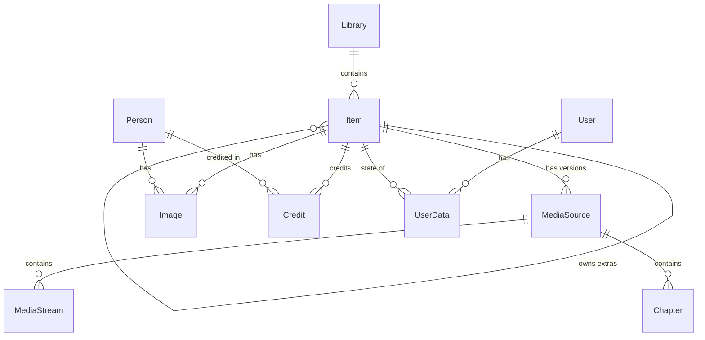

# Mavio 领域模型

> [English](domain.md) | 简体中文

> 相关文档：[架构](architecture.zh-CN.md) · [开发指南](development.zh-CN.md) · [测试策略](testing.zh-CN.md) · [路线图](roadmap.zh-CN.md)

领域模型定义在 `libs/core`（Go 包 `core`）中，只依赖标准库；存储、媒体管线、扫描器和 API 都基于这些类型以及 §9 的仓储端口工作。

---

## 1. 概览

| 实体 | 含义 |
| :--- | :--- |
| `Library` | 媒体库：作为一个整体扫描的一组根目录 |
| `Item` | 媒体库中的节点：可播放条目、容器（剧集、专辑等）或用户整理的合集/播放列表 |
| `MediaSource` | 条目的一个可播放版本：一个文件及其容器信息、流与章节 |
| `MediaStream` | 一条基本流（视频、音频、字幕等），或一个外挂字幕文件 |
| `Image` | 条目或人员的图片 |
| `Person` / `Credit` | 在条目中署名的人员，以及带角色与署名顺序的关联 |
| `User` / `UserPolicy` / `UserPreferences` | 账户、其访问权限及播放偏好 |
| `UserData` | 某个用户对某个条目的状态：是否已播放、续播位置、收藏等 |
| `Job` | 持久化的后台任务 |

---

## 2. 标识符

* 所有实体都用 `core.ID` 标识，即 **UUIDv7**（RFC 9562）。ID 按创建时间排序，使数据库索引以追加为主；同一进程生成的 ID 严格递增，即使在同一毫秒内也是如此。
* 文本形式为标准的 `xxxxxxxx-xxxx-7xxx-xxxx-xxxxxxxxxxxx`；`ID` 实现了 `encoding.TextMarshaler`，在 JSON 中表现为字符串。
* 零值 `NilID` 表示"无"（例如顶层条目的 `ParentID`）。

---

## 3. 枚举

所有枚举都是字符串类型，取值为稳定的小写字符串，在数据库和 JSON 中原样使用。每个枚举都提供全部取值的列表和 `Valid()` 方法。

| 类型 | 取值 |
| :--- | :--- |
| `LibraryKind` | `movies`、`shows`、`music`、`music_videos`、`home_videos`、`books`、`photos`、`mixed` |
| `ItemKind` | `movie`、`series`、`season`、`episode`、`video`、`music_artist`、`music_album`、`track`、`music_video`、`audiobook`、`book`、`photo_album`、`photo`、`folder`、`collection`、`playlist` |
| `ExtraKind` | `trailer`、`clip`、`behind_the_scenes`、`deleted_scene`、`interview`、`scene`、`sample`、`featurette`、`short`、`theme_song`、`theme_video`、`other` |
| `StreamKind` | `video`、`audio`、`subtitle`、`attachment`、`image`、`data` |
| `VideoRange` | `sdr`、`hdr10`、`hdr10plus`、`hlg`、`dolby_vision` |
| `ImageKind` | `primary`、`backdrop`、`logo`、`thumb`、`banner`、`art`、`disc`、`screenshot` |
| `CreditKind` | `actor`、`guest_star`、`director`、`writer`、`producer`、`creator`、`composer`、`conductor`、`lyricist`、`artist`、`author`、`narrator`、`other` |
| `SeriesStatus` | `continuing`、`ended`、`unreleased` |
| `Video3DFormat` | `half_sbs`、`full_sbs`、`half_tab`、`full_tab`、`mvc` |
| `MetadataField` | `cast`、`genres`、`production_locations`、`studios`、`tags`、`name`、`overview`、`runtime`、`official_rating` |
| `SubtitleMode` | `""`（遵循流标记）、`always`、`foreign`、`forced`、`none`、`smart` |
| `SortField` | `name`、`date_added`、`premiere_date`、`production_year`、`community_rating`、`runtime`、`index`、`random`、`last_played`、`play_count` |
| `JobState` | `pending`、`running`、`succeeded`、`failed` |
| `Provider` | `tmdb`、`tmdb_collection`、`imdb`、`tvdb`、`musicbrainz_artist`（常用取值；插件可使用其他名称） |

---

## 4. 媒体库与条目

### 4.1 媒体库
* `Kind` 决定扫描器如何解读目录；`Paths` 是绝对路径的根目录，一个路径最多属于一个媒体库：媒体库的路径不能与其他媒体库的路径相同、包含或被包含（`ErrConflict`）。
* `ScanInterval` 是定时对账扫描的周期（为零则不定时扫描）；`PreferredLanguage`（ISO 639-1）与 `MetadataCountry`（ISO 3166-1 alpha-2）影响元数据提供者的取数。

### 4.2 条目
所有种类共用一个 `Item` 类型，由 `Kind` 决定哪些字段有意义。这直接对应存储层的一张条目表，避免类型继承体系。

| 字段分组 | 字段 |
| :--- | :--- |
| 标识与层级 | `ID`、`LibraryID`、`ParentID`、`Kind`、`Path` |
| 标题与文本 | `Name`、`SortName`、`OriginalTitle`、`Overview`、`Tagline` |
| 编号 | `IndexNumber`、`ParentIndexNumber`、`IndexNumberEnd` |
| 日期与评分 | `ProductionYear`、`PremiereDate`、`EndDate`、`Runtime`、`OfficialRating`、`CustomRating`、`ParentalRating`、`CommunityRating`（0–10）、`CriticRating`（0–100） |
| 分类 | `Genres`、`Tags`、`Studios`、`ExternalIDs`（按 `Provider`）、`ProductionLocations`（制片国家）、`RemoteTrailers`（预告片 URL） |
| 电影与视频 | `CollectionName`（电影系列）、`AspectRatio`、`Video3DFormat` |
| 音乐 | `Artists`、`AlbumArtists`、`Album` |
| 剧集 | `SeriesStatus`、`AirDays`、`AirTime`、`DisplayOrder` |
| 单集 | `AirsBeforeSeasonNumber`、`AirsAfterSeasonNumber`、`AirsBeforeEpisodeNumber`（特别篇的插播位置） |
| 附加内容 | `Extra`（`ExtraKind`）、`OwnerID` |
| 元数据控制 | `MetadataLanguage`、`MetadataCountry`（覆盖媒体库的设置）、`Locked`、`LockedFields`（`MetadataField`） |
| 记账字段 | `DateAdded`、`FileModified`、`MetadataRefreshedAt` |

模型以 Jellyfin 为参照，并随路线图演进：某个阶段需要时才加入相应字段。`SortName` 是用户指定的排序名（即 Jellyfin 的 `ForcedSortName`），计算出的排序形式是存储层的键。单集所属的剧集和季是它的祖先条目，不复制名称。锁定的条目或被锁定的字段分组不会被元数据刷新修改。

### 4.3 层级
层级通过 `ParentID` 表达；编号使用 `IndexNumber` / `ParentIndexNumber`：

| 媒体库种类 | 层级 | 编号 |
| :--- | :--- | :--- |
| `shows` | `series` → `season` → `episode` | 季：`IndexNumber` 为季号；集：`ParentIndexNumber` 为季号，`IndexNumber` 为集号，多集文件的最后一集记在 `IndexNumberEnd` |
| `music` | `music_artist` → `music_album` → `track` | 音轨：`ParentIndexNumber` 为碟号，`IndexNumber` 为曲号 |
| `movies`、`music_videos`、`home_videos`、`books` | 顶层条目，可放在 `folder` 条目中 | — |
| `photos` | `photo_album` → `photo` | — |

`collection` 和 `playlist` 是用户整理的容器，没有 `Path`。

* `ItemKind.IsContainer()` 对用于归组其他条目的种类返回 true（剧集、季、艺人、专辑、相册、文件夹、合集、播放列表）。
* `ItemKind.HasMedia()` 对有可播放文件的种类返回 true（电影、单集、视频、音轨、音乐视频、有声书）；这些条目拥有媒体源。

### 4.4 附加内容
预告片、花絮、主题曲等附加内容是普通条目：设置 `Extra`，并用 `OwnerID` 指向所属条目。查询默认排除附加内容，除非设置 `ItemQuery.IncludeExtras`。

### 4.5 规则（`Item.Validate`）
* 必须有 `ID`、`LibraryID`、合法的 `Kind` 和非空的 `Name`；条目不能是自己的父级。
* 设置了 `Extra` 的条目必须使用合法的 `ExtraKind`，并有 `OwnerID`。
* `CommunityRating` 在 0–10 之间，`CriticRating` 在 0–100 之间，`ParentalRating` 不能为负。
* `Video3DFormat` 与 `LockedFields` 必须是已知取值；`AirDays` 必须是星期几。

### 4.6 分级
`OfficialRating` 是公布的内容分级（如 "PG-13"）；用户设置的 `CustomRating` 优先于它；`ParentalRating` 是它在该国分级体系中的分数，由元数据提供者设置，为零表示未分级。分级过滤（`ItemQuery.MaxRating`、`UserPolicy.MaxParentalRating`）比较的是分数。

---

## 5. 媒体源、流与章节

* `MediaSource` 是条目的一个可播放版本；一个条目可以有多个版本（如 4K 和 1080p），以 `Name` 区分。它记录 `Path`、`Container`（ffprobe 的格式名）、`Size`、`Duration`、`Bitrate`、`Streams` 与 `Chapters`、用于切分 HLS 分片的视频 `Keyframes`（提取前为 nil）以及 `ProbedAt`。
* `MediaStream` 是一条基本流；外挂字幕文件也表示为流，此时设置 `ExternalPath`，`Index` 为排在内嵌流之后的合成序号。编解码器名称沿用 ffprobe（`hevc`、`eac3`、`subrip` 等）；`CodecTag` 保留容器标签（如 `hvc1` 与 `hev1`），这对直放判断很重要；`Language` 使用 ISO 639-2/B。
* 视频流记录尺寸、`FrameRate`（`Rational`，如 24000/1001）、像素格式与位深、色彩描述（范围、原色、传递特性、色彩空间）、`Range`（`VideoRange`）、杜比视界配置记录（`DolbyVision`：profile、level、基础层兼容 ID、RPU / EL / BL 是否存在）、隔行、旋转与采样宽高比。
* 音频流记录声道数、声道布局与采样率；字幕流记录 `TextBased`（PGS、VobSub 等位图格式为 false，只能烧录）。
* `Chapter` 是带名称的起始位置，可附带提取出的缩略图。
* 规则：媒体源必须有 `ID`、`ItemID` 和 `Path`，大小、时长和码率不能为负；每条流必须有合法的 `Kind`，序号、尺寸和声道数不能为负。

---

## 6. 图片、人员与署名

* `Image` 属于某个条目或人员（`OwnerID`），并有 `Kind`；同一种类的多张图片按 `Index` 排序（如多张背景图）。它记录本地 `Path` 和/或来源 `RemoteURL`、尺寸，以及 `Blurhash` / `Thumbhash` 占位图。图片至少要有本地路径或远程地址之一。
* `Person` 记录姓名、简介、生卒信息与 `ExternalIDs`。
* `Credit` 把人员关联到条目，包含 `CreditKind`、可选的 `Role`（饰演的角色或更具体的职务）以及署名顺序 `Order`。

---

## 7. 用户

* `User` 的 `Name` 唯一且不区分大小写。认证方式二选一：`PasswordHash`（PHC 格式字符串，如 `$argon2id$…`），或通过 `AuthProvider` 指定的插件认证。`Admin` 与 `Disabled` 控制账户。
* `UserPolicy`：
  * `Libraries` 把访问限制在列出的媒体库内（nil 表示全部）；由 `CanAccessLibrary` 判断。
  * `MaxParentalRating` 是允许的最高分级分数（"PG-13" 这类内容分级按国家分级体系映射为分数；为零表示不限制）；设置了上限时，`BlockUnrated` 会隐藏没有分级的条目。
  * `AllowTranscoding`、`AllowDownload`、`MaxStreamingBitrate`（比特每秒，为零表示不限）与 `MaxSessions`（为零表示不限）。
* `UserPreferences`：按偏好顺序排列的音频与字幕语言（ISO 639-2/B）、`SubtitleMode`，以及是否优先选择默认音轨而非偏好语言。
* `UserData` 是某个用户对某个条目的状态：`Played`、`PlayCount`、续播位置 `Position`、上次选择的音频/字幕流（字幕为 `-1` 表示关闭）、`Favorite`、可选的 0–10 分 `Rating` 以及时间戳。没有记录表示"从未交互"。

---

## 8. 后台任务

`Job` 是保存在数据库中的持久化后台任务（扫描、元数据刷新、图片提取等）。

* `Kind` 标识任务类型（如 `library.scan`）；`Payload` 是该类型的参数，通常为 JSON。
* `UniqueKey` 用于去重：若已有相同 key 的待执行或执行中任务，再次入队不做任何事（如 `library.scan:<媒体库 ID>`）。
* 工作者按优先级（其次按 `RunAt`）**租用**到期的任务；租约在 `LeaseExpiresAt` 到期且未续租时，任务重新变为可用，因此工作者崩溃也不会丢失任务。`Attempts` 统计的是租用次数，因此因崩溃中断的尝试也会计入。
* `Extend`、`Complete` 与 `Fail` 要求调用者持有租约；租约已过期并被接管的工作者会得到 `ErrConflict`。
* 一次尝试失败后，在 `RetryDelay(attempts)` 之后重试——30 秒，此后翻倍（1 分钟、2 分钟……），最长一小时——直到达到 `MaxAttempts`，此时任务变为 `failed`。
* 状态流转：`pending` → `running` → `succeeded` / 重试时回到 `pending` / `failed`。

---

## 9. 仓储端口

`core.Store` 是访问存储的唯一入口；`libs/store` 为 SQLite 与 PostgreSQL 实现它。其他模块只依赖这些接口。

| 端口 | 职责 |
| :--- | :--- |
| `LibraryRepository` | 增删改查；删除媒体库会删除其全部条目 |
| `ItemRepository` | `Get`、`GetByPath`、`Query`（分页）、`Walk`（按 ID 顺序以 `iter.Seq2` 流式返回全部匹配项）、按 ID 批量 `Upsert`（同一媒体库内路径唯一：`ErrConflict`）、`Delete`（级联删除后代、附加内容、媒体源、图片、署名与用户数据）、`Values`（去重后的流派、标签、工作室或艺人，见 §9.2） |
| `MediaSourceRepository` | 列出并 `Replace` 条目的媒体源 |
| `ImageRepository` | 列出并 `Replace` 所有者的图片 |
| `PersonRepository` | `Get`、不区分大小写的 `FindByName`、批量 `Upsert`、`Search`（见 §9.2）、列出并 `Replace` 条目的署名 |
| `UserRepository` | 增删改查，以及不区分大小写的 `GetByName` |
| `UserDataRepository` | `Get`（不存在时返回 `ErrNotFound`）、按一组条目 `GetMany`、`Put` |
| `JobQueue` | `Enqueue`（报告是否入队）、`Lease`、`Extend`、`Complete`、`Fail` |

* **事务**：`Store.InTx` 用一个绑定到同一事务的 `Store` 执行函数；函数返回错误时回滚。
* **Replace 语义**：`Replace*` 方法设置某个所有者的完整集合，删除不在新集合中的内容——扫描与元数据刷新总是整组写入。
* **错误**：实现包装 `ErrNotFound`、`ErrConflict`（唯一键或状态冲突）与 `ErrInvalid`（违反领域规则），调用方用 `errors.Is` 判断。

### 9.1 条目查询
`ItemQuery` 中零值字段表示"不过滤"：

* 范围：`LibraryIDs`（调用方在此应用用户的媒体库权限）、`ParentID` 及可选的 `Recursive`（全部后代）、`Kinds`、`IncludeExtras`。
* 内容：`Search`（见 §9.2）；`Genres`、`Tags`、`Studios`（匹配任意一个，按清洗形式比较，见 §9.2）；`PersonID`；`YearFrom`–`YearTo`；`MaxRating`（未分级的条目默认包含，除非设置 `SkipUnrated`）。
* 名称按排序名以 Jellyfin 的方式排序：不区分大小写和重音，忽略开头、中间和结尾的冠词（"the"、"a"、"an"），去掉标点 `,&-{}'` 并把 `.+%` 视为空格，数字按数值排序（"Rocky 2" 在 "Rocky 10" 之前），非拉丁文字转写为拉丁字母（中文按拼音排序）。按首映日期排序时无日期的条目排在最后，按最近播放排序时从未播放的条目排在最后。
* 按用户（需要 `UserID`）：`Played`、`Favorite`、`Resumable`，以及 `last_played` / `play_count` 排序。
* 排序：`SortSpec` 列表；结果总是以 ID 作为最后的排序键，保证分页稳定。
* 分页：`Limit`（为零表示上限 `MaxPageSize` = 1000）与 `Offset`；`Page.Total` 为所有页的总数。
* `Validate` 拒绝不一致的查询：超出范围的 limit、负的 offset、没有父级的 `Recursive`、空的年份区间、未知的种类或排序字段，以及没有用户的用户过滤或排序。

### 9.2 搜索
条目搜索（`ItemQuery.Search`）、人员搜索（`PersonRepository.Search`，按姓名）和值列表（`ItemRepository.Values` 与 `ValueQuery`）遵循 Jellyfin 内置搜索提供者的规则：

* **清洗形式**：名称与关键词以清洗形式比较：去除变音符号、转小写、把非字母非数字的字符都替换为空格、合并空白（因此 "Spider-Man" 即 "spider man"）。全角字符也会转为半角。清洗后为空的关键词不做过滤。
* **匹配**：满足以下任一条件即匹配：清洗后的名称包含清洗后的关键词；原始标题（仅条目；转小写、去变音符号）与去掉首尾空白的关键词按模式匹配，其中 `%` 匹配任意长度字符、`_` 匹配单个字符；或排序名（§9.1）与关键词的排序形式按同样的模式匹配。排序形式使 "spiderman" 能找到 "Spider-Man"，"hanks tom" 能找到排序名为 "Hanks, Tom" 的人员，拼音能找到中文标题。
* **相关度**：结果先按清洗后名称的相关度排列，再应用其他排序：完全匹配最先，其次是以关键词开头的名称，然后是包含"关键词加空格"的名称，最后是其余结果。相关度相同时，条目按 `Sort` 再按排序名，人员按排序名，值列表按值的排序名排序。
* **值列表**：`ValueQuery` 列出某个 `ValueKind`（`genre`、`tag`、`studio`，或包含专辑艺人的 `artist`）的去重值，可用 `LibraryIDs` 限定范围。清洗形式相同的值视为同一个值，`Genres`、`Tags`、`Studios` 过滤也是如此。
