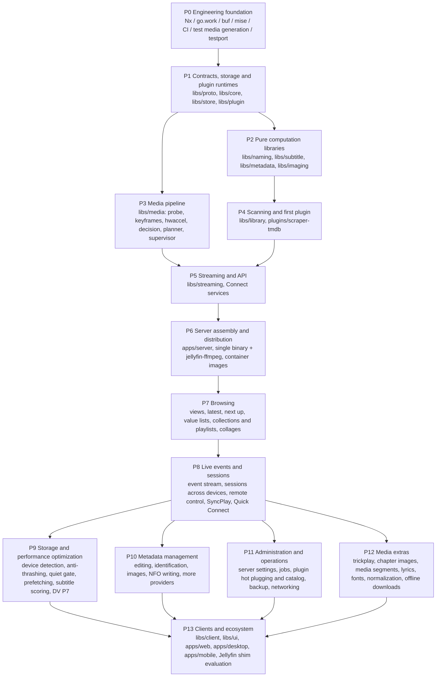

# Mavio Roadmap

> English | [简体中文](roadmap.zh-CN.md)

> Related: [Architecture](architecture.md) · [Domain Model](domain.md) · [Development](development.md) · [Testing](testing.md) · [Optimization](optimization.md) · [AGENTS.md](../AGENTS.md)

---

## 1. Principles

* **Bottom-up**: build the low-level libraries with no business dependencies first, then assemble layer by layer; each layer depends only on completed layers below it.
* **Definition of done**: a phase is complete when its libraries pass their tests, including all ported test cases (or cases explicitly marked skip with a reason), see [Testing §2](testing.md#2-porting-test-cases-from-jellyfin).
* **Server first**: P7 to P12 complete the server, by comparing it with Jellyfin's server (its API controllers and providers); the clients come last, in P13, on a finished API.
* **Integration smoke tests**: starting from P1, the end of each phase adds an integration test in `apps/server/internal/smoke` that wires the completed libraries together. It is not an MVP; it only exposes interface drift early, reducing the bottom-up approach's risk of "discovering problems only at final integration".

---

## 2. Phase Overview

| Phase | Theme | Status |
| :--- | :--- | :--- |
| P0 | Engineering foundation | ✅ Done |
| P1 | Contracts, storage and plugin runtimes | ✅ Done |
| P2 | Pure computation libraries | ✅ Done |
| P3 | Media pipeline | ✅ Done |
| P4 | Scanning and first plugin | ✅ Done |
| P5 | Streaming and API | ✅ Done |
| P6 | Server assembly and distribution | In progress |
| P7 | Browsing | ✅ Done |
| P8 | Live events and sessions | ✅ Done |
| P9 | Storage and performance optimization | ✅ Done |
| P10 | Metadata management | ✅ Done |
| P11 | Administration and operations | Not started |
| P12 | Media extras | Not started |
| P13 | Clients and ecosystem | Not started |

---

## 3. Phase Details

### P0 Engineering Foundation
**Scope**: repository skeleton, mise, Nx, go.work, buf, golangci-lint + depguard; CI matrix (linux amd64/arm64, macOS, Windows); `tools/fixtures`, `tools/testport`.

**Done when**: `nx affected` works; `tidy-check` (`GOWORK=off`) passes.

**Progress**:
- [x] Go module skeleton and `go.work`; Nx with the local plugin `tools/nx-go` (infers projects and the dependency graph)
- [x] Toolchain versions pinned with mise
- [x] buf and the first contract `mavio.system.v1.SystemService`; `apps/server` serves a Connect health check
- [x] golangci-lint and depguard dependency-direction rules
- [x] CI workflow: affected-project checks, generated-code check, `buf breaking`, multi-platform test matrix
- [x] `tools/fixtures`: test media generation
- [x] `tools/testport`: Jellyfin test case extraction

### P1 Contracts, Storage and Plugin Runtimes
**Scope**: first version of the `proto` contracts; `core` domain model; `store` (ent + Atlas + sqlc, both dialects) and the job queue; `plugin` with both runtimes and the handshake.

**Done when**: repository conformance tests pass on both SQLite and PostgreSQL; a crashing plugin does not affect the host and is restarted automatically.

**Progress**:
- [x] `libs/core`: domain model and repository ports ([Domain Model](domain.md))
- [x] `libs/proto`: first version of the contracts (library, user, system, plugin)
- [x] `libs/store`: SQLite and PostgreSQL implementation of the ports, including the job queue
- [x] `libs/plugin`: WASM and child-process runtimes
- [x] Smoke test `apps/server/internal/smoke`: a queued metadata refresh fetched from a plugin (both runtimes), stored with its credits and found by search

### P2 Pure Computation Libraries
**Scope**: `naming`, `subtitle`, `metadata` (NFO), `imaging`.

**Done when**: all corresponding ported cases pass.

**Progress**:
- [x] `libs/naming`: Jellyfin's naming rules for movies, episodes, seasons, series, stacks, versions, extras, music, audiobooks, books and external files; all ported cases pass or are skipped with a reason
- [x] `libs/subtitle`: SRT / SSA / ASS / WebVTT parsing, conversion to SRT / SSA / ASS / WebVTT / TTML / JSON, time-window filtering and character set detection
- [x] `libs/metadata`: NFO reading for movies, videos, music videos, series, seasons, episodes (including multi-episode files), albums and artists; provider IDs in URLs; movie NFO locations. Writing NFO files is left to the phase that saves metadata.
- [x] `libs/imaging`: Jellyfin's size rules, resizing with sharpening on downscale, image formats and SVG safety checks. WebP encoding and placeholders (blurhash / thumbhash) come with the image API in P5, collages with browsing in P7.
- [x] Smoke test `apps/server/internal/smoke`: an episode's files are named, read from NFO, stored with their credits and found again; its subtitle is converted to WebVTT and its poster resized

### P3 Media Pipeline
**Scope**: `probe`, `keyframes`, `hwaccel`, `decision`, `planner`, `supervisor`.

**Done when**: all ported StreamBuilder and EncodingHelper cases pass; real transcode smoke tests pass on the hardware available: the maintainers' own machines and the GitHub-hosted CI runners. Vendor paths without such hardware are covered by the ported argument-derivation cases only.

**Progress**:
- [x] `probe`: ffprobe output normalized as Jellyfin does, including Dolby Vision, HDR10+ and range types; all ported cases pass
- [x] `keyframes`: keyframe times from ffprobe packet flags
- [x] `hwaccel`: version checks, codec, filter and option listings, VideoToolbox trial encodes, VA-API driver checks
- [x] `decision`: StreamBuilder with `ClientCapabilities` in place of `DeviceProfile`, and stream selection; all 307 StreamBuilder cases pass
- [x] `planner`: filter graph IR, CMAF HLS and progressive commands; software and VideoToolbox strategies; all ported EncodingHelper cases pass
- [x] `supervisor`: lifecycle, idle reaping, throttling, progress, served segments
- [x] Smoke test `apps/server/internal/smoke`: an HDR10 HEVC file is probed, direct played by a capable client and transcoded to H.264 HLS from a seek position for a web client, under supervision
- [x] Real transcodes on the GitHub-hosted runners (CI job `media`, Linux and macOS)

### P4 Scanning and First Plugin
**Scope**: `library` scanner (full reconciliation, see [Architecture §9](architecture.md#9-library-scanning-and-change-detection-libslibrary)), resolver chain, job scheduling; `plugins/scraper-tmdb` (WASM).

**Done when**: ported library resolver cases pass; scan results are identical on both databases; reconciliation converges to the correct state for additions / deletions / renames / content changes / temporarily unavailable mount points.

**Progress**:
- [x] Resolver chain, one folder at a time: movies, shows, music, books, home videos and photos, extras, `.ignore` files; ported resolver cases pass
- [x] Scanner: scan generations, missing items kept and purged after a grace period, folders pruned by modification time and file ID, unreadable folders keep their items
- [x] Jobs: scans, probes and metadata refreshes on the job queue, with leases and scheduled scans
- [x] `plugins/scraper-tmdb`: movies, series, seasons and episodes from TMDB; ported `TmdbUtils` cases pass, missing-episode cases skipped until virtual episodes are in the domain model
- [x] Adapters in `apps/server`: metadata plugins as providers, ffprobe as prober
- [x] Smoke test `apps/server/internal/smoke`: a film and a shows library are scanned as jobs with a WASM plugin as provider; additions, deletions, renames, rewritten files and an unavailable library folder converge to the same state on SQLite and PostgreSQL

### P5 Streaming and API
**Scope**: `streaming` (CMAF HLS, on-demand segmenting, seeking, segment cache); Connect services (library, playback, user, system).

**Done when**: ported HLS cases pass; playback verified on real hls.js and AVFoundation clients. Media3 is verified in P13, with the Android client.

**Progress**:
- [x] `libs/streaming`: playlists of the whole media source, RFC 6381 codec strings, segments generated on demand with restarts on seek, segments of copied video joined from one file per group of pictures; ported HLS cases pass
- [x] Authentication: first administrator, sign-in per device with hashed access tokens, argon2id passwords, `mavio.auth.v1.AuthService`, bearer-token and request-validation interceptors
- [x] Playback: `mavio.playback.v1.PlaybackService` and media endpoints for direct play and HLS remuxes and transcodes, remembered and preferred streams, resume positions and played state; verified end to end with real ffmpeg
- [x] Subtitle delivery: text subtitles as converted files, from external files or extracted with ffmpeg, and as HLS renditions
- [x] Library, item and user Connect services; the server runs the library jobs
- [x] Image endpoint: local and provider artwork, resized with Jellyfin's size rules and cached
- [x] WebP encoding (`gen2brain/vpx`) negotiated with clients; blurhash / thumbhash placeholders computed in the library jobs
- [x] Playback verified with the development player on hls.js in Chromium: direct stream, transcodes, seeking with restarts, an HLS subtitle rendition in sync, progress and stop
- [x] Playback verified with the development player on Safari's native HLS, which is AVFoundation's: direct stream, transcodes, seeking with restarts, an HLS subtitle rendition in sync. HLS subtitle renditions are WebVTT segmented along the video without `X-TIMESTAMP-MAP`; if a player misplaces them, add one derived from the video's timestamps

### P6 Server Assembly and Distribution
**Scope**: `apps/server` assembly; `CGO_ENABLED=0` cross-compilation; container images bundling jellyfin-ffmpeg's portable build, the one `mise.toml` pins. Publishing images comes later.

**Done when**: end-to-end smoke test: scan → scrape → playback decision → HLS playback.

**Progress**:
- [x] Assembly in `apps/server/internal/server`, which `cmd/mavio` runs with its flags
- [x] Plugins started from the plugin folder (`-plugin-dir`); their configurations stored, validated against the manifest's schema and applied through `SystemService` without a restart; metadata plugins take part in library refreshes once ready
- [x] End-to-end test of the assembled server through its API with real ffmpeg and a WASM metadata plugin: an administrator configures the plugin, a library is scanned, its film scraped and played as an HLS direct stream
- [x] `CGO_ENABLED=0` cross-compilation to Linux, macOS and Windows on amd64 and arm64 (`server:dist`), checked in CI
- [x] Container images for linux/amd64 and linux/arm64 bundling jellyfin-ffmpeg's portable build, built and run in CI

### P7 Browsing
**Scope**: what a client lists and opens.

- The user's library views; latest items per library; continue watching and next up for series
- Series, seasons and episodes; albums and artists
- Genres, studios, people and years with item counts, which `libs/store` already queries
- Collections and playlists: create, edit, reorder and delete; the domain model already has both
- Library and collection collages
- Display preferences per user and client, kept by the server so they follow the user across devices
- Inherited parental ratings

**Done when**: an end-to-end test through the API browses a scanned film and shows library through the views, latest items, next up and genres, builds a playlist, and does not show the episodes of a series rated above the user's limit.

**Progress**:
- [x] Inherited parental ratings: an unrated item takes its nearest rated ancestor's score, derived by the store on every write and backfilled for existing databases; rating filters and access checks use it
- [x] Rating scores: metadata refreshes map content ratings to scores with Jellyfin's rating systems (`metadata.RatingScore`, its ported cases pass); unrated is nil rather than zero, in items and in policies' maximum ratings
- [x] Genres, tags, studios, artists, years and people with item counts (`ItemService.ListValues`, `ListPeople`), limited to the items the user may access
- [x] Latest items (`ListLatestItems`) grouped into series, seasons and albums as in Jellyfin, and next up (`ListNextUp`) with specials in aired order; item responses name an episode's series and season and a track's album. Continue watching is `ListItems` with `resumable`, sorted by last played
- [x] Collections (`CollectionService`, administrators) and playlists (`PlaylistService`, each user their own, with entries that can repeat items and move) in curated libraries the server creates; their items listed through `ListItems` with them as parent
- [x] Display preferences per user, client and view (`DisplayPreferencesService`), with names and values the client chooses
- [x] Collages of libraries, collections and playlists (`/images/collages/{id}`, `imaging.Collage`), drawn without text
- [x] Scans refresh the metadata of new items without media (series, seasons, albums), which only media files' probes did before
- [x] End-to-end test of the assembled server through its API (`internal/server`, `TestBrowsing`): films and shows scanned with their NFO files and browsed through the views, latest items, next up and genres; a user limited to PG builds a playlist and sees no episode of a TV-14 series

### P8 Live Events and Sessions
**Scope**: what a client learns without asking, and what one device does to another.

- Events: a stream per signed-in device carrying library changes, played state and progress from the user's other devices, job progress and plugin states
- Sessions: what is playing on each device; remote control of one device from another (play, pause, seek, stop, messages)
- Synchronized playback (SyncPlay): groups sharing one play state, waiting for members that buffer
- Signing in a new device from a signed-in one (Quick Connect)

**Done when**: an end-to-end test through the API: a device receives a library change after a scan and another device's progress, and controls that device's playback; two devices in a SyncPlay group stay at the same position. Timing logic is tested with `testing/synctest`.

**Progress**:
- [x] Event streams (`EventService`): library changes, item states, sessions, commands, scans and plugins, each device getting what its user may see; the store is observed so that writes reach the streams once committed
- [x] Sessions (`SessionService`): devices online while streaming, what each plays, remote commands
- [x] Quick Connect (`AuthService`): a new device signed in by entering its code on a signed-in one
- [x] SyncPlay (`SyncPlayService`): groups of devices playing one queue at one position, waiting for buffering members, as in Jellyfin; timing tested with `testing/synctest`
- [x] End-to-end test of the assembled server through its API (`internal/server`, `TestLiveEvents`): a TV learns of the film a scan found and of a phone's playback and state, pauses the phone, and both are told to start a SyncPlay group at the same time and position

### P9 Storage and Performance Optimization
**Scope**: end-to-end I/O latency mitigation and speculative warming ([Optimization](optimization.md)); language/dialect-aware subtitle scoring; high-fidelity video pipeline enhancements; zero-fuzz release verification.

- Multi-dimensional storage medium and protocol identification: native detection of local SSDs, rotational HDDs, remote network shares (SMB/NFS), and cloud mounts across Linux, Windows, and macOS
- Anti-thrashing physical drive serialization (`VolumeLedger`): single-flight queues for rotational media, eliminating head contention during scans and probes
- Foreground streaming quiet gate (`QuietGate`): automatic yielding and throttling of background library scans and disk maintenance while client playback sessions are active
- In-progress write detection (`GrowthPolicy`): write-window and size-stability checks to avoid scanning partially downloaded or actively growing files
- Speculative index and metadata prefetching (`PrefetchHeadTail`): targeted warming of container headers and index atoms via `posix_fadvise` and sequential fallback
- Subtitle scoring and dialect normalization: language scoring matrix, Chinese variant normalization (Traditional/Simplified/regional dialects), and hearing-impaired downranking
- High-fidelity video pipeline adaptations: Dolby Vision Profile 7 EL extraction and fallback tone-mapping; black border detection (`cropdetect`)
- Security and release invariants: pinned dependency verification and fail-closed privacy checks

**Done when**: cross-platform unit and integration tests pass for storage detection, concurrency serialization, quiet gates, and prefetching on Linux, Windows, and macOS; rotational disks remain sequential during scans; playback startup cleanly interrupts background I/O; subtitle scoring correctly matches Chinese regional dialects.

**Progress**:
- [x] Multi-dimensional device and protocol identification: `libs/library/storage` with native Linux (`sysfs`/`st_dev`), macOS (`statfs`/`fsid`), and Windows (`GetDriveType`/`IOCTL_STORAGE_QUERY_PROPERTY`) implementations
- [x] Anti-thrashing volume serialization: `VolumeLedger` with physical device keying, FIFO fair queuing, and configurable concurrency
- [x] Foreground streaming quiet gate: `QuietGate` with reader-writer locking, reference counting, scan-interruption checks, and idle spin-down delay
- [x] In-progress write detection: `GrowthPolicy` with size-stability polling and write-window thresholds
- [x] Speculative prefetch scheduler: `PrefetchHeadTail` with `posix_fadvise(WILLNEED)` on Linux and sequential chunk warming fallback
- [x] Integration of `libs/library/storage` into the scanner and probes: devices detected once per folder (`storage.Detector`); only drives with a seek penalty and remote or cloud volumes are serialized, the walker reading one folder at a time on them and each folder listing and probe holding the device; a probe of several versions on one disk no longer waits for itself
- [x] `QuietGate` and prefetching in playback: starting a playback and every media request extend the quiet window, as khuaplayer's foreground storage gate does, instead of holding background I/O for whole playbacks
- [x] Subtitle scoring and Chinese alias normalization: sidecar subtitle files attached to their videos by scans, with languages from their names (Chinese variants included) and ordered by the scoring model; playback selection matches preferred languages by the normalized aliases
- [x] Dolby Vision Profile 7: separate enhancement-layer tracks, recognized only from their configuration, are never chosen as the video; HDR10 clients get the Base Layer without Dolby Vision metadata
- [x] Black border cropping: borders found by sampling frames (`libs/media/borders`, job `media.borders`), kept on the video stream and cropped by the planner when it re-encodes
- [x] Pinned dependencies: jellyfin-ffmpeg's SHA-256 per platform in `mise.toml`, checked against the Dockerfile's by a test

### P10 Metadata Management
**Scope**: correcting and completing what the library scans find.

- Edit an item and lock its fields; identify an item again against the providers; refresh one item
- List a provider's images; choose, upload and delete images
- Write NFO files and images next to the media (`libs/metadata` only reads NFO files today)
- Providers as plugins: music and books (MusicBrainz, TheAudioDB), more artwork (fanart.tv), subtitle downloads
- Movie collections created from the providers' collections

**Done when**: an end-to-end test through the API: an administrator identifies a misidentified film again and edits it, the locked fields survive a refresh, and the chosen poster is written next to the file and read back by a new scan.

**Progress**:
- [x] `MetadataService`: edit items with an update mask, locks included; refresh one item, optionally replacing its metadata; search the providers and identify an item again
- [x] Images: list the providers' images; choose one by URL or upload it; delete images with their files; chosen artwork beside the media or in the metadata folder (`-metadata-dir`)
- [x] Local metadata: `metadata.WriteNFO`, which `ParseNFO` reads back; libraries saving local metadata write NFO files and save provider images under Jellyfin's local image names
- [x] Provider plugins: `scraper-musicbrainz` (artists, albums, tracks, Cover Art Archive), `scraper-theaudiodb`, `scraper-openlibrary` (books and audiobooks), `scraper-fanart`; subtitle provider contract (`SubtitleProviderService`) with `subtitles-opensubtitles`, downloads saved beside the video
- [x] Automatic movie collections from the providers' collections (`AutoCollections`)
- [x] End-to-end test (`apps/server/internal/server/metadata_test.go`)

### P11 Administration and Operations
**Scope**: running a server without restarting it or editing its flags.

- Server settings stored in the database and set through `SystemService`, taking over from the command-line flags what an administrator changes at run time; first the transcoding settings (hardware acceleration chosen by the administrator, encoder presets, tone mapping, transcode folder)
- Browsing the server's folders to choose library paths
- Jobs: list the scheduled jobs with their last runs, run one now
- Plugin hot plugging: installing, upgrading and uninstalling plugins without restarting the server, as [Architecture §7.3](architecture.md#73-child-process-runtime) states. Today the plugin folder is read at startup only, and only configuration changes apply without a restart
- A plugin catalog to install and upgrade from; authentication and notification plugins, whose contracts (`AuthProvider`, `Notifier`) already exist, used by the server
- API keys for integrations, activity log, server logs, backup and restore, localization data (countries, languages, rating systems)
- Networking: HTTPS with configured certificates, a base URL behind reverse proxies, discovery of servers on the local network

**Done when**: an end-to-end test through the API: an administrator changes a transcoding setting and the next transcode uses it; a plugin is installed from a catalog, upgraded and uninstalled while the server keeps serving; a backup is restored into a new server.

### P12 Media Extras
**Scope**: media features beyond playing a stream.

- Trickplay thumbnail sheets ([Architecture §6.1](architecture.md#61-requirements-and-implementation)) and chapter images
- Media segments (intros, credits) from segment provider plugins
- Lyrics; attached fonts for ASS subtitles rendered by clients; audio normalization
- Progressive transcoding and offline downloads (§4)

**Done when**: tests with real ffmpeg produce trickplay sheets and chapter images, and a progressive transcode is downloaded and played; ported cases pass where Jellyfin has them.

### P13 Clients and Ecosystem
**Scope**: `libs/client`, `libs/ui`; `apps/web`, `apps/desktop`, `apps/mobile`, built on the finished server API; playback verified on Media3 with the Android client; evaluation of a Jellyfin API compatibility shim. Its completion criteria will be defined after P12.

---

## 4. Risks and Open Items

| Item | Description | When |
| :--- | :--- | :--- |
| Platforms on the wazero interpreter | SQLite and WASM codec performance degrades on armv7 / riscv64 | Measure in P1; enable pure-Go fallback build tags for those platforms if needed |
| Cost of dual-dialect sqlc | Hot queries need two copies of the SQL | Keep the ≤ 30-query budget; rely on conformance tests |
| Pure-Go image resizing performance | Large images may resize too slowly | Resize large images with ffmpeg ([Architecture §6.2](architecture.md#62-performance-strategy)) |
| SVG rasterization | Pure-Go options are incomplete | Decided in P2: SVGs are checked and served as-is, not rasterized |
| Hardware test coverage | Only the maintainers' machines and GitHub-hosted runners are available; other vendors' encoders are untested on real hardware | Real transcode tests run where the hardware exists and skip elsewhere; other vendor paths rely on the ported EncodingHelper cases |
| Go modules split too finely | Friction in dependency upgrades and tidying | Keep watching; merge modules when needed |
| Progressive transcoding | Remuxes and transcodes are delivered as HLS only; a client declaring only progressive transcoding profiles gets `unimplemented` | P12, with offline downloads |
| Image subtitles | PGS and VobSub are only burned in, which forces a video transcode | When a client renders PGS itself (P13); then serve the stream as `.sup` |
| Negative audio decode times in fMP4 | HLS outputs keep negative timestamps, so audio that starts before zero (AAC encoder priming) is written with a negative `tfdt`, a field the format defines as unsigned. hls.js and Safari play it, and Jellyfin writes the same for its fMP4 clients; players outside that set are unverified | If a player misplaces or drops the audio: shift only the audio to zero, keeping the video at the source's timestamps |
| Live TV, DVR, channels and DLNA | Large parts of Jellyfin (DLNA as a plugin there) that Mavio has neither adopted nor ruled out | Decide before P13; DLNA would be a plugin |
