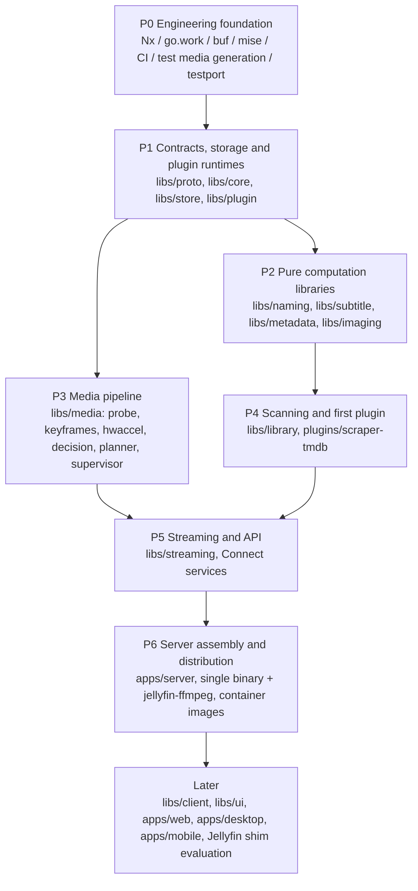

# Mavio Roadmap

> English | [简体中文](roadmap.zh-CN.md)

> Related: [Architecture](architecture.md) · [Domain Model](domain.md) · [Development](development.md) · [Testing](testing.md) · [AGENTS.md](../AGENTS.md)

---

## 1. Principles

* **Bottom-up**: build the low-level libraries with no business dependencies first, then assemble layer by layer; each layer depends only on completed layers below it.
* **Definition of done**: a phase is complete when its libraries pass their tests, including all ported test cases (or cases explicitly marked skip with a reason), see [Testing §2](testing.md#2-porting-test-cases-from-jellyfin).
* **Integration smoke tests**: starting from P1, the end of each phase adds an integration test in `apps/server/internal/smoke` that wires the completed libraries together. It is not an MVP; it only exposes interface drift early, reducing the bottom-up approach's risk of "discovering problems only at final integration".

---

## 2. Phase Overview

| Phase | Theme | Status |
| :--- | :--- | :--- |
| P0 | Engineering foundation | ✅ Done |
| P1 | Contracts, storage and plugin runtimes | ✅ Done |
| P2 | Pure computation libraries | ✅ Done |
| P3 | Media pipeline | ✅ Done |
| P4 | Scanning and first plugin | In progress |
| P5 | Streaming and API | Not started |
| P6 | Server assembly and distribution | Not started |
| P7 | Clients and ecosystem | Not started |

---

## 3. Phase Details

### P0 Engineering Foundation
**Scope**: repository skeleton, mise, Nx, go.work, buf, golangci-lint + depguard; CI matrix (linux amd64/arm64, macOS, Windows); `tools/fixtures`, `tools/testport`.

**Done when**: `nx affected` works; `tidy-check` (`GOWORK=off`) passes.

**Progress**:
- [x] Go module skeleton and `go.work`; Nx with the local plugin `tools/nx-go` (infers projects and the dependency graph)
- [x] Toolchain versions pinned with mise
- [x] buf and the first contract `mavio.system.v1.SystemService`; `apps/server` serves a Connect health check
- [x] golangci-lint and depguard dependency-direction rules
- [x] CI workflow: affected-project checks, generated-code check, `buf breaking`, multi-platform test matrix
- [x] `tools/fixtures`: test media generation
- [x] `tools/testport`: Jellyfin test case extraction

### P1 Contracts, Storage and Plugin Runtimes
**Scope**: first version of the `proto` contracts; `core` domain model; `store` (ent + Atlas + sqlc, both dialects) and the job queue; `plugin` with both runtimes and the handshake.

**Done when**: repository conformance tests pass on both SQLite and PostgreSQL; a crashing plugin does not affect the host and is restarted automatically.

**Progress**:
- [x] `libs/core`: domain model and repository ports ([Domain Model](domain.md))
- [x] `libs/proto`: first version of the contracts (library, user, system, plugin)
- [x] `libs/store`: SQLite and PostgreSQL implementation of the ports, including the job queue
- [x] `libs/plugin`: WASM and child-process runtimes
- [x] Smoke test `apps/server/internal/smoke`: a queued metadata refresh fetched from a plugin (both runtimes), stored with its credits and found by search

### P2 Pure Computation Libraries
**Scope**: `naming`, `subtitle`, `metadata` (NFO), `imaging`.

**Done when**: all corresponding ported cases pass.

**Progress**:
- [x] `libs/naming`: Jellyfin's naming rules for movies, episodes, seasons, series, stacks, versions, extras, music, audiobooks, books and external files; all ported cases pass or are skipped with a reason
- [x] `libs/subtitle`: SRT / SSA / ASS / WebVTT parsing, conversion to SRT / SSA / ASS / WebVTT / TTML / JSON, time-window filtering and character set detection
- [x] `libs/metadata`: NFO reading for movies, videos, music videos, series, seasons, episodes (including multi-episode files), albums and artists; provider IDs in URLs; movie NFO locations. Writing NFO files is left to the phase that saves metadata.
- [x] `libs/imaging`: Jellyfin's size rules, resizing with sharpening on downscale, image formats and SVG safety checks. Codecs beyond the standard library, placeholders (blurhash / thumbhash) and collages come with the image API in P5.
- [x] Smoke test `apps/server/internal/smoke`: an episode's files are named, read from NFO, stored with their credits and found again; its subtitle is converted to WebVTT and its poster resized

### P3 Media Pipeline
**Scope**: `probe`, `keyframes`, `hwaccel`, `decision`, `planner`, `supervisor`.

**Done when**: all ported StreamBuilder and EncodingHelper cases pass; real transcode smoke tests pass on the hardware available: the maintainers' own machines and the GitHub-hosted CI runners. Vendor paths without such hardware are covered by the ported argument-derivation cases only.

**Progress**:
- [x] `probe`: ffprobe output normalized as Jellyfin does, including Dolby Vision, HDR10+ and range types; all ported cases pass
- [x] `keyframes`: keyframe times from ffprobe packet flags
- [x] `hwaccel`: version checks, codec, filter and option listings, VideoToolbox trial encodes, VA-API driver checks
- [x] `decision`: StreamBuilder with `ClientCapabilities` in place of `DeviceProfile`, and stream selection; all 307 StreamBuilder cases pass
- [x] `planner`: filter graph IR, CMAF HLS and progressive commands; software and VideoToolbox strategies; all ported EncodingHelper cases pass
- [x] `supervisor`: lifecycle, idle reaping, throttling, progress, served segments
- [x] Smoke test `apps/server/internal/smoke`: an HDR10 HEVC file is probed, direct played by a capable client and transcoded to H.264 HLS from a seek position for a web client, under supervision
- [x] Real transcodes on the GitHub-hosted runners (CI job `media`, Linux and macOS)

### P4 Scanning and First Plugin
**Scope**: `library` scanner (full reconciliation, see [Architecture §9](architecture.md#9-library-scanning-and-change-detection-libslibrary)), resolver chain, job scheduling; `plugins/scraper-tmdb` (WASM).

**Done when**: ported library resolver cases pass; scan results are identical on both databases; reconciliation converges to the correct state for additions / deletions / renames / content changes / temporarily unavailable mount points.

**Progress**:
- [x] Resolver chain, one folder at a time: movies, shows, music, books, home videos and photos, extras, `.ignore` files; ported resolver cases pass
- [x] Scanner: scan generations, missing items kept and purged after a grace period, folders pruned by modification time and file ID, unreadable folders keep their items
- [x] Jobs: scans, probes and metadata refreshes on the job queue, with leases and scheduled scans
- [x] `plugins/scraper-tmdb`: movies, series, seasons and episodes from TMDB; ported `TmdbUtils` cases pass, missing-episode cases skipped until virtual episodes are in the domain model
- [x] Adapters in `apps/server`: metadata plugins as providers, ffprobe as prober
- [x] Smoke test `apps/server/internal/smoke`: a film and a shows library are scanned as jobs with a WASM plugin as provider; additions, deletions, renames, rewritten files and an unavailable library folder converge to the same state on SQLite and PostgreSQL

### P5 Streaming and API
**Scope**: `streaming` (CMAF HLS, on-demand segmenting, seeking, segment cache); Connect services (library, playback, user, system).

**Done when**: ported HLS cases pass; playback verified on real hls.js / AVPlayer / Media3 clients.

### P6 Server Assembly and Distribution
**Scope**: `apps/server` assembly; `CGO_ENABLED=0` cross-compilation; container images bundling jellyfin-ffmpeg.

**Done when**: end-to-end smoke test: scan → scrape → playback decision → HLS playback.

### P7 Clients and Ecosystem
**Scope**: `libs/client`, `libs/ui`; `apps/web`, `apps/desktop`, `apps/mobile`; evaluation of a Jellyfin API compatibility shim. Its completion criteria will be defined after P6.

---

## 4. Risks and Open Items

| Item | Description | When |
| :--- | :--- | :--- |
| Platforms on the wazero interpreter | SQLite and WASM codec performance degrades on armv7 / riscv64 | Measure in P1; enable pure-Go fallback build tags for those platforms if needed |
| Cost of dual-dialect sqlc | Hot queries need two copies of the SQL | Keep the ≤ 30-query budget; rely on conformance tests |
| Pure-Go image resizing performance | Large images may resize too slowly | Resize large images with ffmpeg ([Architecture §6.2](architecture.md#62-performance-strategy)) |
| SVG rasterization | Pure-Go options are incomplete | Decided in P2: SVGs are checked and served as-is, not rasterized |
| Hardware test coverage | Only the maintainers' machines and GitHub-hosted runners are available; other vendors' encoders are untested on real hardware | Real transcode tests run where the hardware exists and skip elsewhere; other vendor paths rely on the ported EncodingHelper cases |
| Go modules split too finely | Friction in dependency upgrades and tidying | Keep watching; merge modules when needed |
