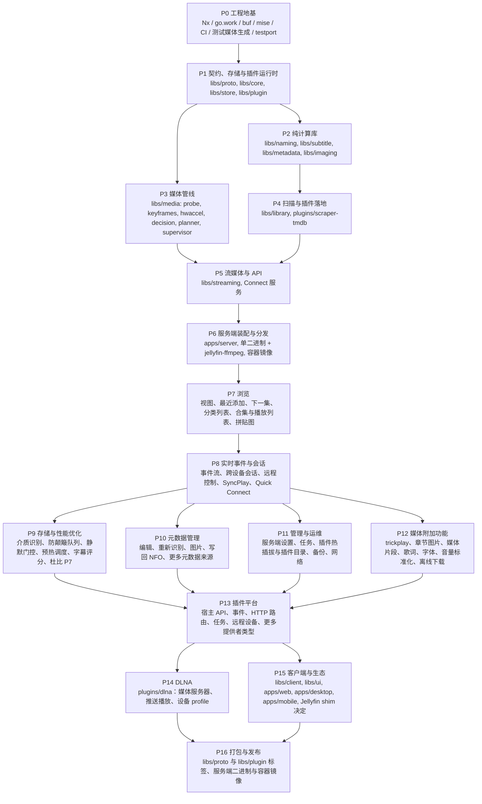

# Mavio 路线图

> [English](roadmap.md) | 简体中文

> 相关文档：[架构](architecture.zh-CN.md) · [领域模型](domain.zh-CN.md) · [开发指南](development.zh-CN.md) · [测试策略](testing.zh-CN.md) · [存储与性能优化](optimization.zh-CN.md) · [AGENTS.zh-CN.md](../AGENTS.zh-CN.md)

---

## 1. 推进原则

* **自底向上**：先实现零业务依赖的底层库，再逐层向上组装；每一层只依赖已完成的下层。
* **完成标准**：一个阶段的库通过各自的测试即为完成，包括全部移植的测试用例（或有明确标记、写明原因的 skip），见[测试策略 §2](testing.zh-CN.md#2-从-jellyfin-移植测试用例)。
* **服务端优先**：P7 至 P12 对照 Jellyfin 服务端（其 API 控制器与元数据提供者）补全服务端；P13 与 P14 让插件能力与 Jellyfin 对齐并加入 DLNA；客户端随后在 P15 基于完成的 API 构建；P16 打包并发布版本。
* **集成冒烟**：从 P1 起，每个阶段结束时在 `apps/server/internal/smoke` 增加一个把已完成的库串起来的集成测试。它不是 MVP，只用来尽早暴露接口漂移，降低自底向上方式"后期集成才发现问题"的风险。

---

## 2. 阶段总览

| 阶段 | 主题 | 状态 |
| :--- | :--- | :--- |
| P0 | 工程地基 | ✅ 已完成 |
| P1 | 契约、存储与插件运行时 | ✅ 已完成 |
| P2 | 纯计算库 | ✅ 已完成 |
| P3 | 媒体管线 | ✅ 已完成 |
| P4 | 扫描与插件落地 | ✅ 已完成 |
| P5 | 流媒体与 API | ✅ 完成 |
| P6 | 服务端装配与分发 | 进行中 |
| P7 | 浏览 | ✅ 已完成 |
| P8 | 实时事件与会话 | ✅ 已完成 |
| P9 | 存储与性能优化 | ✅ 已完成 |
| P10 | 元数据管理 | ✅ 完成 |
| P11 | 管理与运维 | ✅ 完成 |
| P12 | 媒体附加功能 | ✅ 完成 |
| P13 | 插件平台 | ✅ 完成 |
| P14 | DLNA | 进行中 |
| P15 | 客户端与生态 | 未开始 |
| P16 | 打包与发布 | 未开始 |

---

## 3. 阶段详情

### P0 工程地基
**范围**：仓库骨架、mise、Nx、go.work、buf、golangci-lint + depguard；CI 矩阵（linux amd64/arm64、macOS、Windows）；`tools/fixtures`、`tools/testport`。

**完成标准**：`nx affected` 可用；`tidy-check`（`GOWORK=off`）通过。

**进度**：
- [x] Go 模块骨架与 `go.work`；Nx 及本地插件 `tools/nx-go`（自动推断项目与依赖图）
- [x] mise 锁定工具链版本
- [x] buf 与首个契约 `mavio.system.v1.SystemService`；`apps/server` 提供 Connect 健康检查接口
- [x] golangci-lint 与 depguard 依赖方向规则
- [x] CI 工作流：受影响项目检查、生成代码一致性检查、`buf breaking`、多平台测试矩阵
- [x] `tools/fixtures`：测试媒体生成
- [x] `tools/testport`：Jellyfin 测试用例提取

### P1 契约、存储与插件运行时
**范围**：`proto` 契约初版；`core` 领域模型；`store`（ent + Atlas + sqlc，双方言）与任务队列；`plugin` 两种运行时与握手。

**完成标准**：仓储一致性测试在 SQLite 与 PostgreSQL 上均通过；插件崩溃不影响宿主，并能自动重启。

**进度**：
- [x] `libs/core`：领域模型与仓储端口（[领域模型](domain.zh-CN.md)）
- [x] `libs/proto`：第一版契约（library、user、system、plugin）
- [x] `libs/store`：仓储端口的 SQLite 与 PostgreSQL 实现，包括任务队列
- [x] `libs/plugin`：WASM 与子进程两种运行时
- [x] 冒烟测试 `apps/server/internal/smoke`：排队的元数据刷新任务从插件（两种运行时）取得元数据，连同署名一起写入存储，并能被搜索到

### P2 纯计算库
**范围**：`naming`、`subtitle`、`metadata`（NFO）、`imaging`。

**完成标准**：对应的移植用例全部通过。

**进展**：
- [x] `libs/naming`：Jellyfin 的命名规则，覆盖电影、剧集、季、剧集系列、分段、多版本、附加内容、音乐、有声书、图书与外部文件；移植用例全部通过或带原因跳过
- [x] `libs/subtitle`：SRT / SSA / ASS / WebVTT 解析，转换为 SRT / SSA / ASS / WebVTT / TTML / JSON，按时间窗口过滤，以及字符集检测
- [x] `libs/metadata`：读取电影、视频、音乐视频、剧集、季、单集（含多集文件）、专辑与艺人的 NFO；从 URL 中识别提供者 ID；电影 NFO 的位置。写入 NFO 留到保存元数据的阶段。
- [x] `libs/imaging`：Jellyfin 的尺寸规则、缩小时带锐化的缩放、图片格式与 SVG 安全检查。WebP 编码与占位图（blurhash / thumbhash）随 P5 的图片 API 实现，拼贴图随 P7 的浏览实现。
- [x] 冒烟测试 `apps/server/internal/smoke`：解析一集的文件名，读取 NFO，连同署名写入存储并能查到；字幕转换为 WebVTT，海报缩放

### P3 媒体管线
**范围**：`probe`、`keyframes`、`hwaccel`、`decision`、`planner`、`supervisor`。

**完成标准**：StreamBuilder 与 EncodingHelper 的移植用例全部通过；在现有硬件（维护者自己的机器与 GitHub 托管的 CI runner）上的真实转码冒烟测试通过；没有对应硬件的厂商路径只由移植的参数推导用例覆盖。

**进展**：
- [x] `probe`：按 Jellyfin 的方式规范化 ffprobe 输出，包括杜比视界、HDR10+ 与范围类型；移植用例全部通过
- [x] `keyframes`：从 ffprobe 数据包标志得到关键帧时间
- [x] `hwaccel`：版本检查，编解码器、滤镜与选项清单，VideoToolbox 试编码，VA-API 驱动检查
- [x] `decision`：用 `ClientCapabilities` 替代 `DeviceProfile` 的 StreamBuilder 与流选择；StreamBuilder 的 307 个用例全部通过
- [x] `planner`：滤镜图 IR，CMAF HLS 与渐进式命令；软件与 VideoToolbox 策略；EncodingHelper 的移植用例全部通过
- [x] `supervisor`：生命周期、空闲回收、节流、进度、已提供分片
- [x] 冒烟测试 `apps/server/internal/smoke`：一个 HDR10 HEVC 文件经过探测，被有能力的客户端直放，并在监管下为网页客户端从拖动位置转码为 H.264 HLS
- [x] 在 GitHub 托管 runner 上的真实转码（CI 任务 `media`，Linux 与 macOS）

### P4 扫描与插件落地
**范围**：`library` 扫描器（全量对账，见[架构 §9](architecture.zh-CN.md#9-媒体库扫描与变更检测libslibrary)）、解析器链、任务调度；`plugins/scraper-tmdb`（WASM）。

**完成标准**：库解析器移植用例通过；扫描结果在两种数据库上一致；新增 / 删除 / 重命名 / 内容修改 / 挂载点暂时不可用等场景下，对账都收敛到正确状态。

**进展**：
- [x] 逐文件夹的解析器链：电影、剧集、音乐、图书、家庭视频与照片、附加内容、`.ignore` 文件；解析器移植用例通过
- [x] 扫描器：扫描世代，缺失条目保留并在宽限期后清除，按修改时间与文件 ID 剪枝文件夹，无法读取的文件夹保留其条目
- [x] 任务：扫描、探测与元数据刷新在任务队列上运行，带租约与定时扫描
- [x] `plugins/scraper-tmdb`：从 TMDB 获取电影、剧集、季与集；`TmdbUtils` 移植用例通过，缺失剧集用例在虚拟剧集进入领域模型前跳过
- [x] `apps/server` 中的适配器：元数据插件作为提供者，ffprobe 作为探测器
- [x] 冒烟测试 `apps/server/internal/smoke`：以 WASM 插件为提供者，把一个电影库和一个剧集库作为任务扫描；新增、删除、重命名、重写文件与媒体库文件夹不可用的情况下，SQLite 与 PostgreSQL 上收敛到相同状态

### P5 流媒体与 API
**范围**：`streaming`（CMAF HLS、按需分片、seek、分片缓存）；Connect 服务（库、播放、用户、系统）。

**完成标准**：HLS 移植用例通过；hls.js 与 AVFoundation 实机播放验证。Media3 在 P15 中随 Android 客户端验证。

**进度**：
- [x] `libs/streaming`：覆盖整个媒体源的播放列表、RFC 6381 编解码器字符串、按需生成分片并在拖动时重启、直接复制视频的分片由每个图像组一个文件拼接而成；HLS 移植用例通过
- [x] 认证：首个管理员、按设备登录并以散列保存访问令牌、argon2id 密码、`mavio.auth.v1.AuthService`、Bearer 令牌与请求校验拦截器
- [x] 播放：`mavio.playback.v1.PlaybackService` 及直接播放与 HLS 转封装、转码的媒体端点，记住的与偏好的流，续播位置与已播放状态；用真实 ffmpeg 端到端验证
- [x] 字幕交付：文本字幕以转换后的文件交付（来自外挂文件或由 ffmpeg 提取），以及 HLS 字幕轨
- [x] 媒体库、条目与用户的 Connect 服务；服务端运行媒体库任务
- [x] 图片端点：本地与提供者的图片，按 Jellyfin 的尺寸规则缩放并缓存
- [x] 与客户端协商的 WebP 编码（`gen2brain/vpx`）；在媒体库任务中计算 blurhash / thumbhash 占位图
- [x] 通过开发用播放器在 Chromium 的 hls.js 上验证播放：直接串流、转码、拖动并重启转码、同步的 HLS 字幕轨、进度与停止
- [x] 通过开发用播放器在 Safari 的原生 HLS（即 AVFoundation）上验证播放：直接串流、转码、拖动并重启转码、同步的 HLS 字幕轨。HLS 字幕轨是按视频分片切分、不带 `X-TIMESTAMP-MAP` 的 WebVTT；若有播放器错位，则按视频的时间戳推算并加上该头

### P6 服务端装配与分发
**范围**：`apps/server` 装配；`CGO_ENABLED=0` 交叉编译；容器镜像内置 jellyfin-ffmpeg 的便携版，即 `mise.toml` 锁定的那一份。镜像发布属于 P16。

**完成标准**：端到端冒烟测试：扫描 → 刮削 → 播放决策 → HLS 播放。

**进度**：
- [x] 装配位于 `apps/server/internal/server`，`cmd/mavio` 以命令行参数运行它
- [x] 从插件目录（`--plugin-dir`）启动插件；插件配置经 `SystemService` 保存、按清单的 schema 校验并即时生效，无需重启；元数据插件就绪后参与媒体库刷新
- [x] 端到端测试：通过 API 测试装配好的服务端，使用真实 ffmpeg 与 WASM 元数据插件：管理员配置插件，扫描媒体库，刮削其中的影片并以 HLS 直接串流播放
- [x] `CGO_ENABLED=0` 交叉编译到 Linux、macOS、Windows 的 amd64 与 arm64（`server:dist`），并在 CI 中检查
- [x] 内置 jellyfin-ffmpeg 便携版的 linux/amd64 与 linux/arm64 容器镜像，在 CI 中构建并运行

### P7 浏览
**范围**：客户端列出与打开的内容。

- 用户的媒体库视图；各媒体库的最近添加；继续观看与剧集的下一集
- 剧集、季与单集；专辑与艺人
- 带条目数的类型、工作室、人物与年份列表，`libs/store` 已有这类查询
- 合集与播放列表：创建、编辑、排序与删除；领域模型中已有这两者
- 媒体库与合集拼贴图
- 按用户与客户端保存的显示偏好，由服务端保存，因而随用户跨设备
- 继承的分级

**完成标准**：通过 API 的端到端测试：通过视图、最近添加、下一集与类型浏览扫描过的电影与剧集媒体库，创建一个播放列表，且分级高于用户上限的剧集中的单集不可见。

**进度**：
- [x] 继承的分级：未分级的条目取最近一个有分级的祖先的分数，由存储层在每次写入时推导，并为已有数据库回填；分级过滤与访问检查使用它
- [x] 分级分数：元数据刷新用 Jellyfin 的分级体系把内容分级映射为分数（`metadata.RatingScore`，移植用例通过）；条目与权限策略的最高分级中，未分级为 nil 而非零
- [x] 带条目数的类型、标签、工作室、艺人、年份与人物列表（`ItemService.ListValues`、`ListPeople`），只统计用户可访问的条目
- [x] 与 Jellyfin 一样按剧集、季与专辑分组的最近添加（`ListLatestItems`），以及按播出顺序插入特别篇的下一集（`ListNextUp`）；条目响应给出单集所属的剧集与季、曲目所属的专辑。继续观看即带 `resumable` 并按最近播放排序的 `ListItems`
- [x] 合集（`CollectionService`，由管理员整理）与播放列表（`PlaylistService`，每个用户各自的，条目项可重复且可移动），位于服务端创建的整理类媒体库中；以它们为 parent 通过 `ListItems` 列出其中的条目
- [x] 按用户、客户端与视图保存的显示偏好（`DisplayPreferencesService`），名称与值由客户端决定
- [x] 媒体库、合集与播放列表的拼贴图（`/images/collages/{id}`、`imaging.Collage`），不绘制文字
- [x] 扫描为新增的无媒体条目（剧集、季、专辑）刷新元数据，此前只有媒体文件的探测才会触发刷新
- [x] 通过 API 测试装配好的服务端的端到端测试（`internal/server`、`TestBrowsing`）：扫描电影与剧集及其 NFO 文件，并通过视图、最近添加、下一集与类型浏览；限于 PG 的用户创建播放列表，且看不到 TV-14 剧集的任何单集

### P8 实时事件与会话
**范围**：客户端无需询问即可得知的变化，以及一台设备对另一台设备的操作。

- 事件：每个已登录设备一条事件流，传递媒体库变化、用户在其他设备上的播放状态与进度、任务进度与插件状态
- 会话：每台设备正在播放的内容；从一台设备远程控制另一台（播放、暂停、拖动、停止、消息）
- 同步观看（SyncPlay）：组内共享同一播放状态，等待正在缓冲的成员
- 用已登录设备让新设备登录（Quick Connect）

**完成标准**：通过 API 的端到端测试：一台设备在扫描后收到媒体库变化及另一台设备的进度，并控制那台设备的播放；同一 SyncPlay 组的两台设备保持在同一位置。涉及计时的逻辑用 `testing/synctest` 测试。

**进度**：
- [x] 事件流（`EventService`）：媒体库变化、条目状态、会话、命令、扫描与插件，每个设备只收到其用户可见的内容；存储层被观察，写入在提交后到达各流
- [x] 会话（`SessionService`）：设备在事件流打开期间在线、各设备正在播放的内容、远程命令
- [x] Quick Connect（`AuthService`）：在已登录设备上输入新设备的代码，使其登录
- [x] SyncPlay（`SyncPlayService`）：设备分组以同一位置播放同一队列，并等待缓冲中的成员，与 Jellyfin 相同；计时逻辑用 `testing/synctest` 测试
- [x] 通过 API 测试装配好的服务端的端到端测试（`internal/server`、`TestLiveEvents`）：电视得知扫描发现的影片以及手机的播放与状态，暂停手机，两者在 SyncPlay 分组中被告知在同一时刻、同一位置开始

### P9 存储与性能优化
**范围**：端到端 I/O 延迟抑制与预热调度（[存储与性能优化](optimization.zh-CN.md)）；语言/方言感知字幕评分；高保真视频管线增强；零模糊分发验证。

- 多维度存储介质与挂载协议识别：跨 Linux、Windows、macOS 原生识别本地 SSD、机械硬盘（Rotational HDD）、远程网络共享（SMB/NFS）以及云盘网盘（Dataless Mount）
- 物理驱动器防颠簸串行化（`VolumeLedger`）：为机械硬盘建立单并发车道，消除扫描与探测时的多任务随机寻道竞争
- 前台流媒体播放静默门控（`QuietGate`）：前台活跃播放期间自动对后台扫描与磁盘维护任务实施避让降级与暂停
- 写入中未完成文件检测策略（`GrowthPolicy`）：基于写入窗口与尺寸稳定性轮询，避免扫描未下载完成的文件
- 投机式索引与元数据预热调度（`PrefetchHeadTail`）：利用 Linux `posix_fadvise` 与跨平台顺序分块回退，精准预热容器头部元数据与尾部索引
- 字幕评分与方言归一化：语言评分矩阵、中文别名与变体（繁简、地区方言）归一化，以及听障/特效字幕降权
- 高保真视频管线适配：杜比视界 Profile 7 双层 EL 提取与回退色调映射；黑边检测（`cropdetect`）集成
- 分发验证与安全不变量：锁定依赖零模糊验证与隐私防泄漏失败关闭测试

**完成标准**：存储识别、并发串行化、静默门控与预热调度在 Linux、Windows、macOS 上的单元测试与集成测试全部通过；媒体库扫描在机械硬盘上保持顺序吞吐；播放启动干净打断后台 I/O；字幕评分正确匹配中文各方言变体。

**进展**：
- [x] 多维度介质与协议识别：`libs/library/storage` 原生实现 Linux（`sysfs`/`st_dev`）、macOS（`statfs`/`fsid`）与 Windows（`GetDriveType`/`IOCTL_STORAGE_QUERY_PROPERTY`）
- [x] 驱动器防颠簸串行化：`VolumeLedger`，每个卷一个先来先得的槽位
- [x] 前台播放静默门控：`QuietGate`，由前台活动延长、后台读取等过的静默截止时间
- [x] 写入中文件检测：`GrowthPolicy` 排除带下载后缀或在写入窗口内修改过的文件并推迟它们；`Scanner.RunDeferred` 在被推迟的文件稳定或消失后重新扫描其媒体库
- [x] 投机式预热调度器：`PrefetchHeadTail` 在 Linux 上使用 `posix_fadvise(WILLNEED)` 并支持跨平台顺序分块预热回退
- [x] 将 `libs/library/storage` 接入扫描与探测：每个文件夹的设备只识别一次（`storage.Detector`）；只对有寻道代价的驱动器以及远程或云端卷串行化，在这些设备上遍历器一次读一个文件夹，每次列目录与探测都占用该设备；同一磁盘上多个版本的探测不再等待自己
- [x] 播放中的 `QuietGate` 与预热：与 khuaplayer 的前台存储门禁一样，开始播放与每个媒体请求都延长静默窗口，而不是在整个播放期间挡住后台 I/O
- [x] 字幕评分与中文别名归一化：扫描把外挂字幕文件附加到其视频，语言取自文件名（含中文变体），并按评分模型排序；播放选择按规范化后的别名匹配偏好语言
- [x] 杜比视界 Profile 7：仅凭配置识别的独立增强层轨道从不被选为视频；HDR10 客户端得到去掉杜比视界元数据的基础层
- [x] 黑边裁剪：通过采样帧找出黑边（`libs/media/borders`、任务 `media.borders`），记录在视频流上，规划器重新编码时裁掉
- [x] 锁定依赖：`mise.toml` 按平台锁定 jellyfin-ffmpeg 的 SHA-256，并由测试与 Dockerfile 中的锁定比对
- [x] 卷保活：`storage.Keeper` 以绕过缓存的心跳读（`VolumeHeartbeat`）保持进行中播放的卷、以及在场用户“继续观看”媒体的卷（`internal/warming`）不休眠，并在客户端打开条目时唤醒其卷
- [x] 续播延迟：播放从请求位置之前至多 5 秒的关键帧或分段起点开始（`StartPlaybackResponse.start_position`），HLS 在播放开始时即从该处启动 ffmpeg，并预读其附近的媒体
- [x] 每个存储机制的落地对照索引及其与 Jellyfin 的差异（[优化 §1.9](optimization.zh-CN.md)）

### P10 元数据管理
**范围**：修正与补全媒体库扫描得到的内容。

- 编辑条目并锁定字段；对照提供者重新识别条目；刷新单个条目
- 列出提供者的图片；选择、上传与删除图片
- 把 NFO 文件与图片写到媒体旁（`libs/metadata` 目前只读取 NFO 文件）
- 以插件形式提供的元数据来源：音乐与图书（MusicBrainz、TheAudioDB）、更多图片（fanart.tv）、字幕下载
- 按提供者的合集自动创建电影合集

**完成标准**：通过 API 的端到端测试：管理员重新识别一部识别错误的影片并编辑它，锁定的字段在刷新后保持不变，选定的海报写到文件旁并被新的扫描读回。

**进展**：
- [x] `MetadataService`：按更新掩码编辑条目（包括锁定）；刷新单个条目，可选择替换其元数据；搜索提供者并重新识别条目
- [x] 图片：列出提供者的图片；按 URL 选择或上传图片；删除图片及其文件；选定的图片保存在媒体旁或元数据目录（`--metadata-dir`）
- [x] 本地元数据：`metadata.WriteNFO`，可被 `ParseNFO` 读回；保存本地元数据的媒体库写出 NFO 文件，并按 Jellyfin 的本地图片命名保存提供者的图片
- [x] 提供者插件：`scraper-musicbrainz`（艺术家、专辑、音轨，Cover Art Archive）、`scraper-theaudiodb`、`scraper-openlibrary`（图书与有声书）、`scraper-fanart`；字幕提供者契约（`SubtitleProviderService`）与 `subtitles-opensubtitles`，下载的字幕保存在视频旁
- [x] 按提供者的合集自动创建电影合集（`AutoCollections`）
- [x] 端到端测试（`apps/server/internal/server/metadata_test.go`）

### P11 管理与运维
**范围**：运行服务端时无需重启或修改命令行参数。

- 服务端设置保存在数据库中并通过 `SystemService` 设置，把管理员需要在运行时修改的项从命令行参数中接过来；先做转码设置（由管理员选择硬件加速、编码器预设、色调映射、转码目录）
- 浏览服务端目录以选择媒体库路径
- 任务：列出计划任务及其最近一次运行，立即运行某个任务
- 插件热插拔：安装、升级、卸载插件都不需要重启服务端，即[架构 §7.3](architecture.zh-CN.md#73-子进程运行时)所述。目前插件目录只在启动时读取，只有配置修改无需重启
- 可安装与升级插件的插件目录；服务端接入认证与通知插件，其契约（`AuthProvider`、`Notifier`）已经存在
- 供集成使用的 API key、活动日志、服务端日志、备份与恢复、本地化数据（国家、语言、分级体系）
- 网络：使用配置证书的 HTTPS、反向代理下的 base URL、局域网内的服务端发现

**完成标准**：通过 API 的端到端测试：管理员修改一项转码设置，下一次转码即按其执行；服务端持续提供服务的同时从插件目录安装、升级并卸载一个插件；备份恢复到一个新的服务端。

**进展**：
- [x] 服务端设置保存在数据库中，立即生效，某部分拒绝时回滚：转码（硬件加速、编码预设与质量、色调映射、去隔行、缩混、裁剪、转码目录）、网络、插件目录
- [x] 文件夹浏览；任务及其上次与下次运行、立即运行；作业队列；每日清理已结束的作业
- [x] 从插件目录热插拔插件：安装、可回滚的升级、卸载；服务端使用认证与通知插件
- [x] API 密钥；发送给通知插件的活动日志；最近的服务端日志
- [x] 备份与恢复（在两种数据库上的 `store.Dump` 与 `store.Restore`，以及图片与插件）
- [x] 本地化数据：国家、语言、分级体系；移植的 Jellyfin 本地化用例通过（翻译除外）
- [x] 网络：基础 URL、使用配置证书的 HTTPS、局域网发现
- [x] 端到端测试（`apps/server/internal/server/admin_test.go`）

### P12 媒体附加功能
**范围**：播放媒体流之外的媒体功能。

- 预览缩略图（trickplay，[架构 §6.1](architecture.zh-CN.md#61-需求与实现方案)）与章节图片
- 来自媒体片段提供者插件的媒体片段（片头、片尾）
- 歌词；供客户端渲染 ASS 字幕的内嵌字体；音量标准化
- 渐进式转码与离线下载（§4）

**完成标准**：用真实 ffmpeg 的测试生成 trickplay 拼图与章节图片，并下载、播放一个渐进式转码的文件；Jellyfin 有对应用例的部分，移植用例通过。

**进展**：
- [x] 缩略图拼图与章节图片（`libs/media/thumbnails`，任务 `media.trickplay` 与 `media.chapters`），按检测到的黑边裁剪，带失败熔断；从元数据目录提供
- [x] 来自片段提供者插件的媒体片段（`MediaSegmentProviderService`，任务 `media.segments`）
- [x] 歌词（`metadata.ParseLyrics`；Jellyfin 的 ELRC 用例通过），通过 `ItemService.GetLyrics` 提供；向客户端提供字体附件；音轨与专辑的响度（`media.loudness`）作为归一化增益
- [x] 渐进式转封装与转码；下载文件本身或渐进式转码结果
- [x] 使用真实 ffmpeg 的端到端测试（`apps/server/internal/server/extras_test.go`）

### P13 插件平台
**范围**：让 Mavio 两种运行时的插件都能做到 Jellyfin 插件能做的事（频道与直播电视除外）（[插件平台](plugins.zh-CN.md)）：带作用域、可代表用户的宿主 API；面向消费者的事件，以及发给通知插件的全部活动；HTTP 路由；任务与数据目录；远程设备；图片、歌词、本地元数据、保存器、处理器、解析器、片头、图片生成器、媒体源与密码重置提供者；外部 ID 声明；按媒体库的提供者顺序。

**完成标准**：为两种运行时构建的测试插件在端到端测试中通过装配好的服务端使用每一种能力；契约与 SDK 有文档。

**进度**：
- [x] 宿主 API：作用域、代表用户、两种运行时的传输
- [x] 数据目录；任务
- [x] 事件：[插件平台 §4](plugins.zh-CN.md#4-事件) 的事件类型、事件消费者、通知插件
- [x] HTTP 路由
- [x] 远程设备；代表设备
- [x] 图片、歌词、本地元数据、保存器与处理器提供者；外部 ID
- [x] 解析器、片头提供者、图片生成器、媒体源提供者、密码重置
- [x] 按媒体库的提供者顺序
- [x] 端到端测试（使用真实 ffmpeg 的 `apps/server/internal/server/capabilities_test.go` 与 `plugins_test.go`），覆盖两种运行时

### P14 DLNA
**范围**：`plugins/dlna`，第一方进程插件（[插件平台 §10](plugins.zh-CN.md#10-dlnapluginsdlna)）：媒体服务器（SSDP、ContentDirectory、ConnectionManager、带 DLNA 头的媒体）、推送播放（发现渲染器、AVTransport 与 RenderingControl）、设备 profile；为服务端的每个平台构建，进入官方目录与容器镜像。

**完成标准**：端到端测试在回环接口上用模拟的控制点与渲染器发现服务端、浏览媒体库、以 Range 请求播放文件，并驱动渲染器完成播放、暂停、跳转与停止且上报进度；在真实电视上验证播放。

**进度**：
- [ ] SSDP 与设备描述
- [ ] ContentDirectory 与 ConnectionManager
- [ ] 带 DLNA 头的媒体与设备 profile
- [ ] 推送播放
- [ ] 构建、目录与容器镜像
- [ ] 端到端测试

### P15 客户端与生态
**范围**：`libs/client`、`libs/ui`；基于完成的服务端 API 构建 `apps/web`、`apps/desktop`、`apps/mobile`；随 Android 客户端在 Media3 上验证播放；决定是否采用 Jellyfin API 兼容垫片（shim）（[评估](jellyfin-compat.zh-CN.md)）。具体完成标准在 P14 完成后制定。

### P16 打包与发布
**范围**：首批版本发布（[开发指南 §7](development.zh-CN.md#7-发布与版本)）：依次为 `libs/proto` 与 `libs/plugin` 打标签；发布服务端的版本二进制与容器镜像。

**完成标准**：仓库外的插件以 `GOWORK=off`、不用 `replace` 基于打了标签的 `libs/proto` 与 `libs/plugin` 构建成功；某个版本的二进制与镜像已发布，且镜像能启动。

**进度**：
- [ ] 为 `libs/proto` 与 `libs/plugin` 打发布标签
- [ ] 发布服务端的版本二进制与容器镜像

---

## 4. 风险与待决事项

| 事项 | 说明 | 处理时机 |
| :--- | :--- | :--- |
| wazero 解释器平台 | armv7 / riscv64 上 SQLite 与 WASM 编解码器性能退化 | P1 实测；必要时为这些平台启用纯 Go 兜底 build tag |
| sqlc 双方言维护成本 | 热点查询需要两份 SQL | 坚持 ≤ 30 条预算；靠一致性测试兜底 |
| 纯 Go 图像缩放性能 | 大图缩放可能过慢 | 大图改走 ffmpeg 缩放（[架构 §6.2](architecture.zh-CN.md#62-性能策略)） |
| SVG 栅格化 | 纯 Go 方案不完善 | P2 已决定：检查后原样下发，不做栅格化 |
| 硬件测试覆盖 | 只有维护者自己的机器与 GitHub 托管 runner，其他厂商的编码器无法在实机上测试 | 真实转码测试在有硬件处运行、其余处跳过；其他厂商路径依赖移植的 EncodingHelper 用例 |
| Go 模块拆分过细 | 依赖升级与 tidy 的摩擦 | 持续观察，必要时合并模块 |
| 图形字幕 | PGS 与 VobSub 只能烧录，因而强制视频转码 | 有客户端能自行渲染 PGS 时（P15），改为以 `.sup` 交付该流 |
| fMP4 中为负的音频解码时间 | HLS 输出保留负时间戳，因此早于零点开始的音频（AAC 编码器的预填充）会以负的 `tfdt` 写出，而格式规定该字段为无符号数。hls.js 与 Safari 能正常播放，Jellyfin 对其 fMP4 客户端也写出同样的值；此外的播放器未经验证 | 若有播放器放错或丢弃音频：只把音频平移到零点，视频保持源文件的时间戳 |
| 电视直播、录像与频道 | Jellyfin 中体量很大的部分，Mavio 既未采纳也未排除；插件平台不包含它们的提供者类型 | P15 之前决定 |
