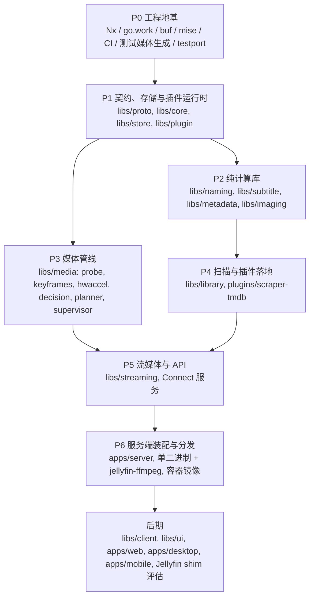

# Mavio 路线图

> [English](roadmap.md) | 简体中文

> 相关文档：[架构](architecture.zh-CN.md) · [领域模型](domain.zh-CN.md) · [开发指南](development.zh-CN.md) · [测试策略](testing.zh-CN.md) · [AGENTS.zh-CN.md](../AGENTS.zh-CN.md)

---

## 1. 推进原则

* **自底向上**：先实现零业务依赖的底层库，再逐层向上组装；每一层只依赖已完成的下层。
* **完成标准**：一个阶段的库通过各自的测试即为完成，包括全部移植的测试用例（或有明确标记、写明原因的 skip），见[测试策略 §2](testing.zh-CN.md#2-从-jellyfin-移植测试用例)。
* **集成冒烟**：从 P1 起，每个阶段结束时在 `apps/server/internal/smoke` 增加一个把已完成的库串起来的集成测试。它不是 MVP，只用来尽早暴露接口漂移，降低自底向上方式"后期集成才发现问题"的风险。

---

## 2. 阶段总览

| 阶段 | 主题 | 状态 |
| :--- | :--- | :--- |
| P0 | 工程地基 | ✅ 已完成 |
| P1 | 契约、存储与插件运行时 | ✅ 已完成 |
| P2 | 纯计算库 | 进行中 |
| P3 | 媒体管线 | 未开始 |
| P4 | 扫描与插件落地 | 未开始 |
| P5 | 流媒体与 API | 未开始 |
| P6 | 服务端装配与分发 | 未开始 |
| P7 | 客户端与生态 | 未开始 |

---

## 3. 阶段详情

### P0 工程地基
**范围**：仓库骨架、mise、Nx、go.work、buf、golangci-lint + depguard；CI 矩阵（linux amd64/arm64、macOS、Windows）；`tools/fixtures`、`tools/testport`。

**完成标准**：`nx affected` 可用；`tidy-check`（`GOWORK=off`）通过。

**进度**：
- [x] Go 模块骨架与 `go.work`；Nx 及本地插件 `tools/nx-go`（自动推断项目与依赖图）
- [x] mise 锁定工具链版本
- [x] buf 与首个契约 `mavio.system.v1.SystemService`；`apps/server` 提供 Connect 健康检查接口
- [x] golangci-lint 与 depguard 依赖方向规则
- [x] CI 工作流：受影响项目检查、生成代码一致性检查、`buf breaking`、多平台测试矩阵
- [x] `tools/fixtures`：测试媒体生成
- [x] `tools/testport`：Jellyfin 测试用例提取

### P1 契约、存储与插件运行时
**范围**：`proto` 契约初版；`core` 领域模型；`store`（ent + Atlas + sqlc，双方言）与任务队列；`plugin` 两种运行时与握手。

**完成标准**：仓储一致性测试在 SQLite 与 PostgreSQL 上均通过；插件崩溃不影响宿主，并能自动重启。

**进度**：
- [x] `libs/core`：领域模型与仓储端口（[领域模型](domain.zh-CN.md)）
- [x] `libs/proto`：第一版契约（library、user、system、plugin）
- [x] `libs/store`：仓储端口的 SQLite 与 PostgreSQL 实现，包括任务队列
- [x] `libs/plugin`：WASM 与子进程两种运行时
- [x] 冒烟测试 `apps/server/internal/smoke`：排队的元数据刷新任务从插件（两种运行时）取得元数据，连同署名一起写入存储，并能被搜索到

### P2 纯计算库
**范围**：`naming`、`subtitle`、`metadata`（NFO）、`imaging`。

**完成标准**：对应的移植用例全部通过。

**进展**：
- [x] `libs/naming`：Jellyfin 的命名规则，覆盖电影、剧集、季、剧集系列、分段、多版本、附加内容、音乐、有声书、图书与外部文件；移植用例全部通过或带原因跳过
- [ ] `libs/subtitle`
- [ ] `libs/metadata`（NFO）
- [ ] `libs/imaging`

### P3 媒体管线
**范围**：`probe`、`keyframes`、`hwaccel`、`decision`、`planner`、`supervisor`。

**完成标准**：StreamBuilder 与 EncodingHelper 的移植用例全部通过；在现有硬件（维护者自己的机器与 GitHub 托管的 CI runner）上的真实转码冒烟测试通过；没有对应硬件的厂商路径只由移植的参数推导用例覆盖。

### P4 扫描与插件落地
**范围**：`library` 扫描器（全量对账，见[架构 §9](architecture.zh-CN.md#9-媒体库扫描与变更检测libslibrary)）、解析器链、任务调度；`plugins/scraper-tmdb`（WASM）。

**完成标准**：库解析器移植用例通过；扫描结果在两种数据库上一致；新增 / 删除 / 重命名 / 内容修改 / 挂载点暂时不可用等场景下，对账都收敛到正确状态。

### P5 流媒体与 API
**范围**：`streaming`（CMAF HLS、按需分片、seek、分片缓存）；Connect 服务（库、播放、用户、系统）。

**完成标准**：HLS 移植用例通过；hls.js / AVPlayer / Media3 实机播放验证。

### P6 服务端装配与分发
**范围**：`apps/server` 装配；`CGO_ENABLED=0` 交叉编译；容器镜像内置 jellyfin-ffmpeg。

**完成标准**：端到端冒烟测试：扫描 → 刮削 → 播放决策 → HLS 播放。

### P7 客户端与生态
**范围**：`libs/client`、`libs/ui`；`apps/web`、`apps/desktop`、`apps/mobile`；Jellyfin API 兼容垫片（shim）评估。具体完成标准在 P6 完成后制定。

---

## 4. 风险与待决事项

| 事项 | 说明 | 处理时机 |
| :--- | :--- | :--- |
| wazero 解释器平台 | armv7 / riscv64 上 SQLite 与 WASM 编解码器性能退化 | P1 实测；必要时为这些平台启用纯 Go 兜底 build tag |
| sqlc 双方言维护成本 | 热点查询需要两份 SQL | 坚持 ≤ 30 条预算；靠一致性测试兜底 |
| 纯 Go 图像缩放性能 | 大图缩放可能过慢 | 大图改走 ffmpeg 缩放（[架构 §6.2](architecture.zh-CN.md#62-性能策略)） |
| SVG 栅格化 | 纯 Go 方案不完善 | P2 评估 resvg 的 WASM 版本，或只做原样下发 |
| 硬件测试覆盖 | 只有维护者自己的机器与 GitHub 托管 runner，其他厂商的编码器无法在实机上测试 | 真实转码测试在有硬件处运行、其余处跳过；其他厂商路径依赖移植的 EncodingHelper 用例 |
| Go 模块拆分过细 | 依赖升级与 tidy 的摩擦 | 持续观察，必要时合并模块 |
