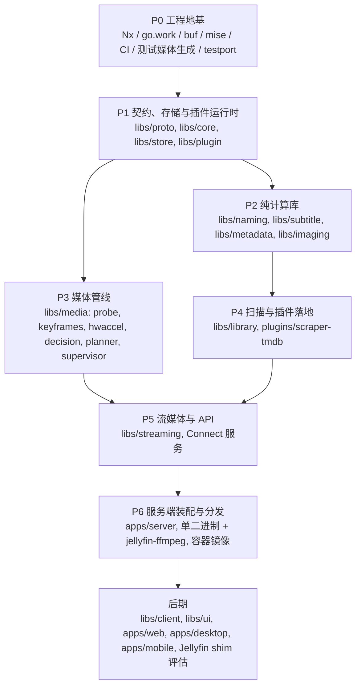

# Mavio 路线图

> [English](roadmap.md) | 简体中文

> 相关文档：[架构](architecture.zh-CN.md) · [领域模型](domain.zh-CN.md) · [开发指南](development.zh-CN.md) · [测试策略](testing.zh-CN.md) · [AGENTS.zh-CN.md](../AGENTS.zh-CN.md)

---

## 1. 推进原则

* **自底向上**：先实现零业务依赖的底层库，再逐层向上组装；每一层只依赖已完成的下层。
* **完成标准**：一个阶段的库通过各自的测试即为完成，包括全部移植的测试用例（或有明确标记、写明原因的 skip），见[测试策略 §2](testing.zh-CN.md#2-从-jellyfin-移植测试用例)。
* **集成冒烟**：从 P1 起，每个阶段结束时在 `apps/server/internal/smoke` 增加一个把已完成的库串起来的集成测试。它不是 MVP，只用来尽早暴露接口漂移，降低自底向上方式"后期集成才发现问题"的风险。

---

## 2. 阶段总览

| 阶段 | 主题 | 状态 |
| :--- | :--- | :--- |
| P0 | 工程地基 | ✅ 已完成 |
| P1 | 契约、存储与插件运行时 | ✅ 已完成 |
| P2 | 纯计算库 | ✅ 已完成 |
| P3 | 媒体管线 | ✅ 已完成 |
| P4 | 扫描与插件落地 | ✅ 已完成 |
| P5 | 流媒体与 API | 进行中 |
| P6 | 服务端装配与分发 | 未开始 |
| P7 | 客户端与生态 | 未开始 |

---

## 3. 阶段详情

### P0 工程地基
**范围**：仓库骨架、mise、Nx、go.work、buf、golangci-lint + depguard；CI 矩阵（linux amd64/arm64、macOS、Windows）；`tools/fixtures`、`tools/testport`。

**完成标准**：`nx affected` 可用；`tidy-check`（`GOWORK=off`）通过。

**进度**：
- [x] Go 模块骨架与 `go.work`；Nx 及本地插件 `tools/nx-go`（自动推断项目与依赖图）
- [x] mise 锁定工具链版本
- [x] buf 与首个契约 `mavio.system.v1.SystemService`；`apps/server` 提供 Connect 健康检查接口
- [x] golangci-lint 与 depguard 依赖方向规则
- [x] CI 工作流：受影响项目检查、生成代码一致性检查、`buf breaking`、多平台测试矩阵
- [x] `tools/fixtures`：测试媒体生成
- [x] `tools/testport`：Jellyfin 测试用例提取

### P1 契约、存储与插件运行时
**范围**：`proto` 契约初版；`core` 领域模型；`store`（ent + Atlas + sqlc，双方言）与任务队列；`plugin` 两种运行时与握手。

**完成标准**：仓储一致性测试在 SQLite 与 PostgreSQL 上均通过；插件崩溃不影响宿主，并能自动重启。

**进度**：
- [x] `libs/core`：领域模型与仓储端口（[领域模型](domain.zh-CN.md)）
- [x] `libs/proto`：第一版契约（library、user、system、plugin）
- [x] `libs/store`：仓储端口的 SQLite 与 PostgreSQL 实现，包括任务队列
- [x] `libs/plugin`：WASM 与子进程两种运行时
- [x] 冒烟测试 `apps/server/internal/smoke`：排队的元数据刷新任务从插件（两种运行时）取得元数据，连同署名一起写入存储，并能被搜索到

### P2 纯计算库
**范围**：`naming`、`subtitle`、`metadata`（NFO）、`imaging`。

**完成标准**：对应的移植用例全部通过。

**进展**：
- [x] `libs/naming`：Jellyfin 的命名规则，覆盖电影、剧集、季、剧集系列、分段、多版本、附加内容、音乐、有声书、图书与外部文件；移植用例全部通过或带原因跳过
- [x] `libs/subtitle`：SRT / SSA / ASS / WebVTT 解析，转换为 SRT / SSA / ASS / WebVTT / TTML / JSON，按时间窗口过滤，以及字符集检测
- [x] `libs/metadata`：读取电影、视频、音乐视频、剧集、季、单集（含多集文件）、专辑与艺人的 NFO；从 URL 中识别提供者 ID；电影 NFO 的位置。写入 NFO 留到保存元数据的阶段。
- [x] `libs/imaging`：Jellyfin 的尺寸规则、缩小时带锐化的缩放、图片格式与 SVG 安全检查。WebP 编码与占位图（blurhash / thumbhash）随 P5 的图片 API 实现，拼贴图随 P7 的客户端实现。
- [x] 冒烟测试 `apps/server/internal/smoke`：解析一集的文件名，读取 NFO，连同署名写入存储并能查到；字幕转换为 WebVTT，海报缩放

### P3 媒体管线
**范围**：`probe`、`keyframes`、`hwaccel`、`decision`、`planner`、`supervisor`。

**完成标准**：StreamBuilder 与 EncodingHelper 的移植用例全部通过；在现有硬件（维护者自己的机器与 GitHub 托管的 CI runner）上的真实转码冒烟测试通过；没有对应硬件的厂商路径只由移植的参数推导用例覆盖。

**进展**：
- [x] `probe`：按 Jellyfin 的方式规范化 ffprobe 输出，包括杜比视界、HDR10+ 与范围类型；移植用例全部通过
- [x] `keyframes`：从 ffprobe 数据包标志得到关键帧时间
- [x] `hwaccel`：版本检查，编解码器、滤镜与选项清单，VideoToolbox 试编码，VA-API 驱动检查
- [x] `decision`：用 `ClientCapabilities` 替代 `DeviceProfile` 的 StreamBuilder 与流选择；StreamBuilder 的 307 个用例全部通过
- [x] `planner`：滤镜图 IR，CMAF HLS 与渐进式命令；软件与 VideoToolbox 策略；EncodingHelper 的移植用例全部通过
- [x] `supervisor`：生命周期、空闲回收、节流、进度、已提供分片
- [x] 冒烟测试 `apps/server/internal/smoke`：一个 HDR10 HEVC 文件经过探测，被有能力的客户端直放，并在监管下为网页客户端从拖动位置转码为 H.264 HLS
- [x] 在 GitHub 托管 runner 上的真实转码（CI 任务 `media`，Linux 与 macOS）

### P4 扫描与插件落地
**范围**：`library` 扫描器（全量对账，见[架构 §9](architecture.zh-CN.md#9-媒体库扫描与变更检测libslibrary)）、解析器链、任务调度；`plugins/scraper-tmdb`（WASM）。

**完成标准**：库解析器移植用例通过；扫描结果在两种数据库上一致；新增 / 删除 / 重命名 / 内容修改 / 挂载点暂时不可用等场景下，对账都收敛到正确状态。

**进展**：
- [x] 逐文件夹的解析器链：电影、剧集、音乐、图书、家庭视频与照片、附加内容、`.ignore` 文件；解析器移植用例通过
- [x] 扫描器：扫描世代，缺失条目保留并在宽限期后清除，按修改时间与文件 ID 剪枝文件夹，无法读取的文件夹保留其条目
- [x] 任务：扫描、探测与元数据刷新在任务队列上运行，带租约与定时扫描
- [x] `plugins/scraper-tmdb`：从 TMDB 获取电影、剧集、季与集；`TmdbUtils` 移植用例通过，缺失剧集用例在虚拟剧集进入领域模型前跳过
- [x] `apps/server` 中的适配器：元数据插件作为提供者，ffprobe 作为探测器
- [x] 冒烟测试 `apps/server/internal/smoke`：以 WASM 插件为提供者，把一个电影库和一个剧集库作为任务扫描；新增、删除、重命名、重写文件与媒体库文件夹不可用的情况下，SQLite 与 PostgreSQL 上收敛到相同状态

### P5 流媒体与 API
**范围**：`streaming`（CMAF HLS、按需分片、seek、分片缓存）；Connect 服务（库、播放、用户、系统）。

**完成标准**：HLS 移植用例通过；hls.js / AVPlayer / Media3 实机播放验证。

**进度**：
- [x] `libs/streaming`：覆盖整个媒体源的播放列表、RFC 6381 编解码器字符串、按需生成分片并在拖动时重启、直接复制视频的分片由每个图像组一个文件拼接而成；HLS 移植用例通过
- [x] 认证：首个管理员、按设备登录并以散列保存访问令牌、argon2id 密码、`mavio.auth.v1.AuthService`、Bearer 令牌与请求校验拦截器
- [x] 播放：`mavio.playback.v1.PlaybackService` 及直接播放与 HLS 转封装、转码的媒体端点，记住的与偏好的流，续播位置与已播放状态；用真实 ffmpeg 端到端验证
- [x] 字幕交付：文本字幕以转换后的文件交付（来自外挂文件或由 ffmpeg 提取），以及 HLS 字幕轨
- [x] 媒体库、条目与用户的 Connect 服务；服务端运行媒体库任务
- [x] 图片端点：本地与提供者的图片，按 Jellyfin 的尺寸规则缩放并缓存
- [x] 与客户端协商的 WebP 编码（`gen2brain/vpx`）；在媒体库任务中计算 blurhash / thumbhash 占位图
- [ ] 在 hls.js / AVPlayer / Media3 实机客户端上验证播放（已通过开发用播放器验证：Chromium 中的 hls.js 通过直接串流、拖动并重启转码、同步的 HLS 字幕轨、进度与停止；Safari 的原生 HLS（即 AVFoundation）通过直接串流，HLS 字幕轨同步，拖动后亦然），包括拖动后 HLS 字幕轨仍保持同步：字幕轨是按视频分片切分、不带 `X-TIMESTAMP-MAP` 的 WebVTT；若有播放器错位，则按视频的时间戳推算并加上该头

### P6 服务端装配与分发
**范围**：`apps/server` 装配；`CGO_ENABLED=0` 交叉编译；容器镜像内置 jellyfin-ffmpeg。

**完成标准**：端到端冒烟测试：扫描 → 刮削 → 播放决策 → HLS 播放。

### P7 客户端与生态
**范围**：`libs/client`、`libs/ui`；`apps/web`、`apps/desktop`、`apps/mobile`；媒体库与合集拼贴图；Jellyfin API 兼容垫片（shim）评估。具体完成标准在 P6 完成后制定。

---

## 4. 风险与待决事项

| 事项 | 说明 | 处理时机 |
| :--- | :--- | :--- |
| wazero 解释器平台 | armv7 / riscv64 上 SQLite 与 WASM 编解码器性能退化 | P1 实测；必要时为这些平台启用纯 Go 兜底 build tag |
| sqlc 双方言维护成本 | 热点查询需要两份 SQL | 坚持 ≤ 30 条预算；靠一致性测试兜底 |
| 纯 Go 图像缩放性能 | 大图缩放可能过慢 | 大图改走 ffmpeg 缩放（[架构 §6.2](architecture.zh-CN.md#62-性能策略)） |
| SVG 栅格化 | 纯 Go 方案不完善 | P2 已决定：检查后原样下发，不做栅格化 |
| 硬件测试覆盖 | 只有维护者自己的机器与 GitHub 托管 runner，其他厂商的编码器无法在实机上测试 | 真实转码测试在有硬件处运行、其余处跳过；其他厂商路径依赖移植的 EncodingHelper 用例 |
| Go 模块拆分过细 | 依赖升级与 tidy 的摩擦 | 持续观察，必要时合并模块 |
| 渐进式转码 | 转封装与转码只以 HLS 交付；只声明了渐进式转码配置的客户端会收到 `unimplemented` | 离线下载需要转码文件时 |
| 图形字幕 | PGS 与 VobSub 只能烧录，因而强制视频转码 | 有客户端能自行渲染 PGS 时（P7），改为以 `.sup` 交付该流 |
| fMP4 中为负的音频解码时间 | HLS 输出保留负时间戳，因此早于零点开始的音频（AAC 编码器的预填充）会以负的 `tfdt` 写出，而格式规定该字段为无符号数。hls.js 与 Safari 能正常播放，Jellyfin 对其 fMP4 客户端也写出同样的值；此外的播放器未经验证 | 若有播放器放错或丢弃音频：只把音频平移到零点，视频保持源文件的时间戳 |
| 继承的分级 | 分级按条目各自过滤，因此分级高于用户上限的剧集中未分级的单集仍可见；Jellyfin 按剧集的分级过滤它们 | 在客户端提供家长控制之前：为每个条目保存继承的分级并据此过滤 |
